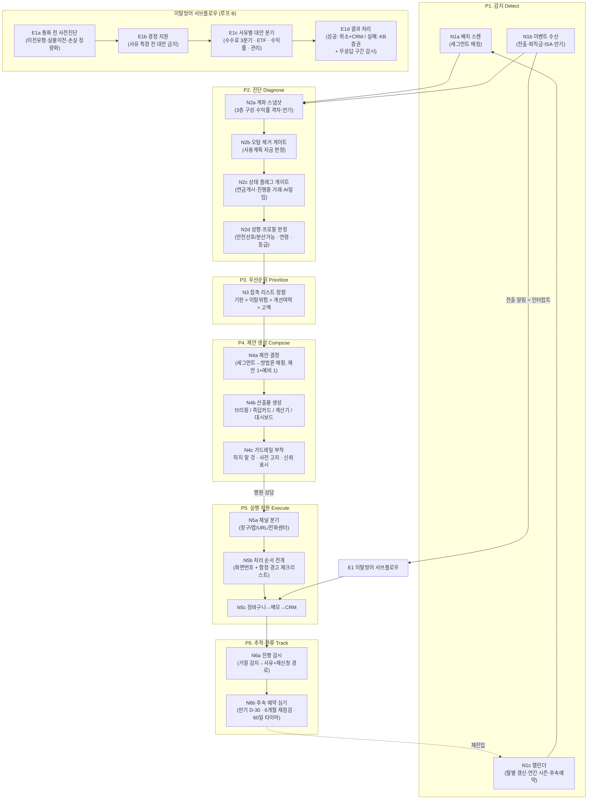

# 사후관리 에이전트 — 업무 핵심 및 처리 흐름도 설계 자료

퇴직연금(개인형IRP) **사후관리** 업무의 핵심을 지식베이스(01~05·07)에서 추출·압축하고,
그 위에서 에이전트의 **처리 흐름도(노드 구성)** 를 설계하기 위한 기준 문서.

- 선행 문서: [01_행원_참고자료_4종_기능정의.md](01_%ED%96%89%EC%9B%90_%EC%B0%B8%EA%B3%A0%EC%9E%90%EB%A3%8C_4%EC%A2%85_%EA%B8%B0%EB%8A%A5%EC%A0%95%EC%9D%98.md) — "무엇을·언제·어떤 형태로" (산출물 스펙)
- 이 문서: **"업무가 실제로 어떻게 돌아가고, 에이전트는 어떤 단계(노드)로 처리하는가"** (처리 구조)
- 표기: `방법론 N` = 05_주제별_추출지식/02_IRP관리방법론 규칙 번호, `세그 N` = 01_고객세그먼트 항목 번호, `절차 N` = 05_업무처리절차 항목 번호, `목소리 N` = 07_인사이트 현장의 목소리 번호

---

## 1부. 사후관리 업무의 핵심

### 1. 한 문장 정의

> 사후관리란 **가입 이후의 계좌를 "방치 → 불만 → 이탈"의 인과 사슬에서 끊어내는 상시 활동**이다.
> 수익률 관리(리밸런싱)는 목적이 아니라 이탈방어의 수단이다. (방법론 38)

이 인과가 자료 전체(2021~2026, 본부·현장 공통)를 관통하는 단 하나의 논리다:

```
저수익 방치  →  고객 불만족  →  타사 이탈
(편중·미운용)    (수익률·관리 불만)   (계약이전 신청)
```

**정량 근거** (방법론 46~49, 116)
- 편중 계좌(고유대 50%↑ or 정기예금 100%)의 이탈률 **14.8% vs 일반 11.8% (1.3배)**
- 전입고객 재이탈 의향 **82.5%** — 데려온 힘도 붙잡는 힘도 상품이 아니라 "사람과 관리"
- '24년 계약이탈 48% 증가, 개인형IRP는 **92% 급증** — 이탈은 구조적 흐름
- 편중 계좌 이탈 시 KPI 가중치 **△1.65** — 제도가 관리를 강제

### 2. 핵심 명제 5가지 (흐름도 설계의 공리)

| # | 명제 | 근거 | 흐름도에 미치는 결과 |
|---|---|---|---|
| 1 | **이탈방어의 진짜 시점은 통보 전이다.** 관리되지 않은 계좌의 이탈은 막을 수 없다 | 방법론 103 | 평상시 상시 루프가 메인 파이프라인, 전출대응은 예외 처리 |
| 2 | **관리는 캠페인이 아니라 사이클이다.** 스캔→만기→수익률→수수료 4수칙 반복 | 방법론 36 | 흐름의 끝이 "완료"가 아니라 **후속 예약 → 재진입(루프)** |
| 3 | **트리거는 3종류다** — 상태(편중·방치), 기한(만기·60일·D-day), 이벤트(전출신청·퇴직금 입금) | 방법론 18·27·41, 세그 전반 | 감지 노드가 배치 스캔 + 이벤트 수신 + 캘린더 3입력을 가짐 |
| 4 | **접촉 전에 오탐과 상태를 걸러야 한다.** 사용계획 자금 접촉·불가능 제안은 신뢰를 깎는다 | 방법론 6·59 | 진단 노드에 오탐 제거·상태 플래그 게이트 필수 |
| 5 | **실행 단계의 실수가 성과를 뒤집는다.** 접수취소·서류누락·무응답 거절·실적 미인정 | 방법론 107, 목소리 4·5 | 실행 이후에 추적·감시 노드가 반드시 이어짐 |

### 3. 업무의 6대 영역 (= 지식의 구조 = 처리 단계의 재료)

02_IRP관리방법론(129규칙)의 그룹 구조가 곧 사후관리 업무의 분해도다.
아래 순서가 대체로 **한 건의 관리 흐름 안에서의 시간 순서**와 일치한다.

| 영역 | 하는 일 | 대표 규칙 |
|---|---|---|
| ① 계좌 진단 | 3층 구성(현금성/원리금/실적배당)·만기·수익률 격차·성향·상태 플래그 읽기 | 방법론 1~8, 54~59 |
| ② 자산배분·상품선택 | 성향 2분기 → 상품 지도(연령×성향) → 대안 상품 특정 | 방법론 9~17, 60~76 |
| ③ 리밸런싱 실행 | 만기=재설계 창구, 계산기 정량비교, 스몰스텝(일부만+가역), 채널 선택 | 방법론 18~23, 77~84 |
| ④ 자금 유입 설계 | 세액공제 잔여한도, ISA 만기 60일, 퇴직금 과세이연 60일 | 방법론 24~28, 85~91 |
| ⑤ 인출·연금수령 설계 | 연금개시·수령방식·인출순서·연 1회 소액인출 | 방법론 29~35, 92~101 |
| ⑥ 관리 사이클·이탈방어 | 4수칙 루틴, 전출 대응 6단계, 사유별 분기, 락인, 사각지대 편입 | 방법론 36~45, 102~111 |

> ②~⑤는 "무엇을 제안할 것인가"의 내용 영역이고, ①과 ⑥이 **흐름(언제·누구에게·어떤 순서로)** 을 결정한다.
> → 흐름도의 뼈대는 ①·⑥에서 나오고, ②~⑤는 제안 생성 노드가 참조하는 지식이 된다.

---

## 2부. 행원의 실제 업무 흐름 (As-Is)

자료에서 확인되는 행원의 사후관리는 **3개의 루프**로 돌아간다. 에이전트는 이 루프를 대체하는 게 아니라 각 단계의 병목(발굴·진단·문서화·감시)을 자동화한다.

### 루프 A. 평상시 상시 관리 (메인 루프)

```
[발굴]           [정렬]          [접촉 전 진단]        [접촉·상담]         [실행]           [기록·재예약]
타겟리스트 조회 →  기한·위험·      →  오탐 제거(사용계획?) →  오프너(자기현황) →  채널 분기      →  CRM 상담기록
만기명세(월초)      개선여력·고액순    상태 플래그 확인       성향 판별 질문      (창구/앱/URL/    후속 예약
사후관리 보고서                      준비자료 4종 확보      제안+사전고지       전화센터)        (만기 D-30 등)
                                                       반론 대응                            └─→ [발굴]로 복귀
```

- **발굴 3경로**: ① 만기도래 명세 ② 저수익률 보고서 ③ 타겟리스트(편중·방치·미납 등) — 방법론 50, 절차 7
- **정렬 원칙**: 기한 임박(60일 타이머·만기) > 이탈위험(편중) > 개선여력 큰 순 > 고액순 — 방법론 50·57, 기능정의 ④
- **접촉 전 진단**: 현금성자산이라도 "1개월 이상 변동 없음 + 입금사유가 교체매매·연금지급 아님"일 때만 방치로 판정(방법론 6) / 연금개시·거래진행중·AI일임 등 상태 플래그로 불가능 제안 차단(방법론 59)
- **상담**: 세금우대조회([04-10-099])로 문 열기(방법론 54, 목소리 2) → 성향 2분기(방법론 7·9) → 제안 1개+예비 1개 → 사전 고지 세트(목소리 5)
- **실행**: 채널 분기부터 — 창구(녹취·저속)/앱(표준)/URL 발송(직원명 수기입력 조건)/전용센터(예금→예금만) — 방법론 80~82, 목소리 8
- **기록·재예약**: CRM 등록(이탈방어 공식 절차의 ③), 6개월~1년 재점검 약속(방법론 79) → 루프 재진입

### 루프 B. 이벤트 대응 (전출 알림 = 최우선 인터럽트)

```
[전출 알림 수신] → [통화 전 4단계 사전진단] → [경청: 사유 특정] → [사유별 대안 분기] → [결과 처리]
                   거래현황 → 이전유형 →        (특정 전 대안 금지)   5유형(본부) /        성공: 전출취소+녹취+CRM
                   실물이전 가능여부 →                              4유형(현장)          실패: KB증권 소개(계열 유지)
                   상품별 손실 정량화                                                   +무응답 구간 감시
```

- 사유 분기(방법론 40·102): 수수료(고객 조건 3분기 — 유일하게 속성으로 답이 결정) / ETF 라인업 / ETF 매매시간 / 수익률 / 관리 소홀(→1:1 상담 연계) (+VIP·대출동반 특수 유형)
- 퇴직금 포함 계좌는 주제를 "인출 설계"로 전환해 2차 방어(방법론 44)
- 이전 절차상 **최종 의사확인(알림톡→AI콜봇) 무응답 = 자동취소** — 이 구간이 마지막 방어 기회(방법론 107, 절차 33)

이 밖의 이벤트 트리거: 퇴직금 통장 입금(60일 과세이연 골든타임, 방법론 27), 퇴직금 IRP 입금 후 운용지시 미실행(방법론 28), ISA 만기(60일, 방법론 26·85), 연금개시 요건 도래(방법론 29).

### 루프 C. 실행 후 진행 감시

```
[신청 접수] → [상태 수시 조회] → 거절/취소 감지 → [사유 분류(4~5종)] → [재신청 경로 안내] → 완료 확인 → 루프 A로
```

- 지금은 행원이 [06-AD-080]·[04-12-646]을 **수동으로 수시 조회** — 자동화 우선순위 1번(목소리 4)
- 거절 사유는 현장이 이미 분류해 둠: 비밀번호 미설정, 상품변경 진행 중, 퇴직금 일부 입금, 타행 디폴트옵션 미해지 등 (세그 56, 절차 35·36)

---

## 3부. 에이전트 처리 흐름도 (To-Be 노드 설계)

### 1. 설계 원칙

1. **As-Is 루프 구조를 보존한다.** 노드는 행원 업무 단계와 1:1로 대응해야 근거 자료를 그대로 콘텐츠로 쓸 수 있고, 행원이 흐름을 신뢰한다.
2. **노드는 "판단"과 "생성"을 분리한다.** 판단(세그먼트 매칭·오탐 제거·우선순위)은 규칙 기반으로 결정적이어야 하고(민원 리스크), 생성(브리핑·대사·메모 초안)은 LLM이 담당한다.
3. **모든 출력 노드는 기능정의 7원칙을 상속한다.** (도착해 있을 것 / 한 장+근거 접기 / 완성 대사체 / 원 단위 금액+기준시점 / 신뢰 표시 / 하지 말 것 / 완성형)
4. **끝나는 노드는 없다.** 모든 경로의 종점은 후속 예약 → 감지 노드로의 재진입이다. (명제 2)

### 2. 전체 흐름도



### 3. 노드별 상세 스펙

#### P1. 감지 (Detect) — "누구를, 왜, 지금"

| 노드 | 입력 | 처리 | 출력 | 재료 |
|---|---|---|---|---|
| **N1a 배치 스캔** | 계좌·고객 데이터 (일 배치) | 세그먼트 정의(01 문서 약 60종)와 매칭. 핵심 10종: 편중(고유대50%↑/정기예금100%) · 대기 현금성자산 · 만기 D-30 · 디폴트옵션 미등록 · 성과부진펀드 보유 · 수익률 저조 · 미접촉 6개월+ · 납입 중단 · 세액공제 잔여한도 · 연금개시 도래 | (고객, 세그먼트, 근거 수치) 튜플 | 세그 1~59 |
| **N1b 이벤트 수신** | 실시간/일 단위 이벤트 | 전출 신청(최우선), 퇴직금 통장 입금, 퇴직금 IRP 입금(운용지시 미실행), ISA 만기, 전입 완료(재이탈 위험군 편입) | 이벤트 티켓 + 기한 타이머(60일 등) | 세그 2·17·18·21·58, 방법론 26~28·41 |
| **N1c 캘린더** | 월력·후속예약 DB | 월말: 익월 특별제공상품·금리 갱신 / 연초(1~3Q): 퇴직금 대량지급 시즌 / 11월: 세액공제 실질 마감 / 개별 후속예약 도래 | 갱신 알림·시즌 태스크·재접촉 티켓 | 방법론 53·78·90, 절차 15 |

#### P2. 진단 (Diagnose) — "접촉해도 되는가, 무엇이 문제인가"

| 노드 | 처리 | 탈락/분기 조건 | 재료 |
|---|---|---|---|
| **N2a 계좌 스냅샷** | 적립금을 3층(현금성/원리금보장/실적배당)으로 분해, 만기·수익률을 세 기준선(IRP평균 7.97% / 정기예금 3.02% / 고유대 2.52%, 갱신 필요)과의 **격차**로 계산. 납입액·공제한도·최근 접촉이력 포함 | — | 방법론 1·3, 절차 1~5 |
| **N2b 오탐 제거 게이트** | 현금성자산: ①1개월 이상 변동 없음 AND ②입금사유 ≠ 교체매매·연금지급 → 방치 판정 | 오탐이면 **접촉 보류** (리스트에서 제외 또는 보류 태그) | 방법론 6, 세그 26 |
| **N2c 상태 플래그 게이트** | 연금개시(추가납 불가), 거래 진행 중(이전·지급 불가), 퇴직금 일부 입금, AI일임(이전·인출 제한), 위험자산 70% 초과(컴플라이언스) | 상태별로 **가능한 제안 집합을 제한** — 불가능 제안 원천 차단 | 방법론 59, 세그 54~56 |
| **N2d 성향·프로필 판정** | 펀드 이력 교차조회(퇴직연금 전체기간 + 공모펀드 폐기계좌 포함) → 안전선호/분산가능 2분기. 성향설문 vs 실운용 불일치 검출. 연령(TDF 빈티지)·등급(VIP)·은퇴까지 기간 | 분기 결과가 P4의 상품 방향을 결정 | 방법론 5·7·9·62·65, 세그 27·30·32 |

#### P3. 우선순위 (Prioritize) — "누구부터"

| 정렬 키 (상위 우선) | 논리 | 재료 |
|---|---|---|
| ① 기한 임박 | 60일 타이머(퇴직금·ISA)·만기 D-30 — 지나면 기회 소멸 | 기능정의 ④, 방법론 26·27 |
| ② 이탈 위험 | 편중(1.3배)·전입이력(재이탈 82.5%)·미접촉 장기 | 방법론 46·48, 세그 1·21 |
| ③ 개선 여력 | "최소 행동으로 상태가 바뀌는 계좌 먼저" (예: 자기부담금 0→30만원) | 방법론 57 |
| ④ 금액 고액순 | 동순위 내 타이브레이커 | 방법론 50·57 |

- 부점당 일일 접촉 수 상한(2021년 200명 설계 참고)으로 리스트 소화 가능성 보장 — 방법론 50
- KPI 실적 인정 정보 병기(단, 반영 범위는 팀 결정) — 목소리 1, 방법론 111

#### P4. 제안 생성 (Compose) — "무엇을, 어떤 말로"

| 노드 | 처리 | 재료 |
|---|---|---|
| **N4a 제안 결정** | (세그먼트 × 성향 × 상태) → 방법론 규칙 매핑 → **제안 1개 + 예비 1개** (5개 나열 금지). 예: 편중+안전선호 → 저축은행 예금/GIC (금리 비슷하면 실물이전 불가 상품 = 사전 락인, 방법론 42) / 편중+분산가능 → TDF·포트폴리오 / 만기+미등록 → 디폴트옵션 등록+예약변경 세트 | 방법론 ②~⑤ 전체, 특히 9·10·16·42 |
| **N4b 산출물 생성** | 시점별 4형태로 렌더링: 영업 전 브리핑(1장) / 영업 중 즉답카드·판별질문·계산기 / 영업 후 장바구니 / 평상시 대시보드. 완성 대사체·원 단위 금액·기준시점 | 기능정의 ①~④, 03_영업화법 102건 |
| **N4c 가드레일 부착** | ⚠하지 말 것(수익률 직접 지적 금지·"고유계정대" 용어 금지·연금개시 계좌 추가납 권유 금지) + 사전 고지 문구(중도해지 원금손실·3영업일·세전 금액) + 신뢰 표시(본부공식/현장팁/대외공개) | 방법론 4·58, 목소리 5, 기능정의 원칙 5·6 |

#### P5. 실행 지원 (Execute) — "어느 채널로, 어떤 순서로"

| 노드 | 처리 | 재료 |
|---|---|---|
| **N5a 채널 분기** | 고객×상품 → 창구(녹취·저속) / 스타뱅킹 앱 / URL 발송(직원명 수기입력 조건 경고) / 모바일브랜치(인증서 無) / 전용센터 1599-0099(예금→예금만) 판정 | 방법론 80~82, 목소리 8, 절차 16·27·28 |
| **N5b 처리 순서 전개** | 합의 항목별 화면번호 순서 + 함정 경고 생성. 예: 디폴트옵션 상향 = ⓐ등록변경→ⓑ보유상품변경 **2단계**, ETF 편입 = 현금화→매수 2단계·15:15 분기점, 하나은행 전입 = 비밀번호 선등록 | 절차 18~23·36, 목소리 4 |
| **N5c 장바구니→메모→CRM** | 상담 중 합의/보류 항목 적재 → 상담 메모 초안 → CRM 등록·실적 등록 확인 | 기능정의 ③ |

#### P6. 추적·환류 (Track) — "끝까지, 그리고 다시"

| 노드 | 처리 | 재료 |
|---|---|---|
| **N6a 진행 감시** | 신청 건 상태 자동 조회([06-AD-080]·[04-12-646] 상당) → 거절·취소 감지 → 사유 분류(비밀번호·거래중·일부입금·디폴트옵션 미해지 등) + 재신청 경로 안내. **최종 의사확인 무응답 구간 알림**(방어 마지막 기회) | 방법론 107, 세그 56, 절차 33·35, 목소리 4 |
| **N6b 후속 예약** | 만기 D-30, ISA 만기 D-7, 6개월~1년 재점검, 60일 타이머 → N1c 캘린더에 등록 (루프 폐쇄) | 방법론 36·79, 기능정의 ③ |

#### E. 이탈방어 서브플로우 (전출 알림 인터럽트)

| 노드 | 처리 | 재료 |
|---|---|---|
| **E1a 통화 전 사전진단** | 거래현황 → 이전 유형(현금/실물) → 실물이전 가능상품 대조 → **보유상품별 손실 정량화**(중도해지 손실·환매 기회손실, 원 단위). "전액현금대체" = 손실 최대 신호 | 방법론 41, 절차 29·30 |
| **E1b 경청 지원** | 통화 목적 프레이밍("저지"가 아니라 "안내+불편 확인"). **사유 특정 전 대안 제시 금지** — 판별 질문 제공 | 방법론 39 |
| **E1c 사유별 대안 분기** | 수수료(고객 조건 3분기: 55세↑면제/퇴직금5천만↑면제/비대면 전환) · ETF 라인업·시간 · 수익률 · 관리 소홀(1:1 상담 연계) · VIP·대출동반 특수형. 퇴직금 보유 시 인출 설계로 주제 전환 | 방법론 40·102·106·109·44, 03_영업화법 |
| **E1d 결과 처리** | 성공: 녹취→전출취소→CRM 등록(공식 3단계) / 실패: KB증권 소개(계열 유지) + 무응답 자동취소 구간 감시 | 방법론 118, 절차 34, 목소리 4 |

### 4. 노드 ↔ 지식베이스 매핑 요약

| 노드 그룹 | 주 재료 문서 | 쓰임 |
|---|---|---|
| P1 감지 | 01_고객세그먼트 (약 60세그먼트) | 세그먼트 정의·임계값 = 스캔 조건 |
| P2 진단 | 02_방법론 그룹①, 05_절차(조회 화면) | 판정 규칙·오탐 제거·상태 플래그 |
| P3 우선순위 | 02_방법론 50·57, 07_인사이트 1 | 정렬 논리·KPI 병기 |
| P4 제안 생성 | 02_방법론 그룹②~⑤, 03_영업화법 102건, 04_팩트 76건 | 제안 매핑·대사·수치 검증 기준 |
| P5 실행 지원 | 05_업무처리절차 74건 + 화면번호 일람 | 채널 분기·처리 순서·함정 |
| P6 추적 | 05_절차 33·35, 07_인사이트 4 | 거절 사유 분류·감시 포인트 |
| E 이탈방어 | 02_방법론 그룹⑥, 03_영업화법 이탈방어 14건 | 6단계 프레임·사유별 분기 |

---

## 4부. 설계 확정 전 결정·검증 필요 사항

| # | 쟁점 | 내용 | 관련 |
|---|---|---|---|
| 1 | 이탈 사유 분류 체계 | 본부 5유형(비대면/수수료/ETF다양성/ETF시간/수익률) vs 현장 4유형(ETF/수익률/수수료/관리소홀) — E1c 분기 설계에 직결 | 방법론 40·102 |
| 2 | KPI 득점 지식 반영 범위 | 실적 인정 정보 표시는 채택 조건이지만, "고객 최선 ≠ 득점 최선" 충돌 케이스(예: 시중은행 정기예금 매수 미인정)의 처리 원칙 | 방법론 111, 목소리 1 |
| 3 | 데이터 상충 | 디폴트옵션 변경 2단계(사내) vs 매도 불필요(KBthink) — **최우선 상충**. 현금성자산 임계값(100만/500만/10만) 자료 간 상이 | 절차 18, 세그 3 |
| 4 | 수치 갱신 파이프라인 | 기준선 수익률·특별제공상품 금리·잔여한도는 월 단위 갱신 — N1c가 담당하되 갱신 실패 시 출력 차단 정책 필요 (틀린 수치 = 민원) | 방법론 15·16·78 |
| 5 | 진행 감시 데이터 접근 | N6a·E1d의 자동 감시는 신청 상태 조회 데이터 연동이 전제 — 연동 불가 시 "조회 리마인더" 수준으로 강등할지 | 절차 33·35 |
| 6 | 비대면 권유 컴플라이언스 | 해피콜에서 특정 펀드 언급은 금소법 위반 소지 — N4b가 채널(전화/대면)에 따라 상품 특정 수준을 조절해야 함 | KPI시나리오 참고 문구 |
| 7 | 추론 규칙 검증 | `도출: 추론` 표시 규칙(전담 지정 편입, 무응답 구간 방어 등)은 팀 검증 후 반영 | 방법론 45·107 |

---

## 부록. 트리거 → 제안 매핑 조견표 (N1→N4 압축판)

| 트리거(세그먼트/이벤트) | 기한 | 1차 제안 | 예비 제안 | 주의 |
|---|---|---|---|---|
| 편중(고유대 50%↑/정기예금 100%) | 상시 | 성향 분기 후 리밸런싱(저축은행·GIC / TDF·포트) | 디폴트옵션 등록 | 오탐 게이트 필수, "고유계정대" 용어 금지 |
| 대기 현금성자산 방치 | 상시 | 운용지시 (스몰스텝 500만~1천만) | 디폴트옵션 | 사용계획 자금 제외 |
| 정기예금 만기 D-30 | 만기일 | 예약변경(특별제공상품) | 성향따라 TDF 일부 | 금리는 월 단위 확정 — 월말 매수 주의 |
| 성과부진펀드 보유 | 상시 | 추천펀드·ETF 교체 | — | 감정 인정 후 "운용 여건" 논거, 수익률 단정 금지 |
| 수익률 저조 | 상시 | 비교그룹 대조 → 분산투자 | 고금리 원리금보장 | 직접 지적 금지 (민감) |
| 디폴트옵션 미등록+만기 임박 | 만기일 | 사전지정 등록 + 예약변경 세트 | — | 2단계 거래 함정 경고 |
| 세액공제 잔여한도 | 11월 실질마감 | 자동이체 증액·추가납 | 1,800만원 한도 채우기 | 연금개시 계좌 제외 |
| ISA 만기 | D-60~+60일 | IRP 전환(추가 세액공제 300만) | 만기 후 재접촉 예약 | 60일 기한 타이머 |
| 퇴직금 통장 수령 감지 | +60일 | 과세이연 입금(세금 환급 금액 제시) | — | 골든타임 타이머, 시즌(1~3월) 대량 발생 |
| 퇴직금 IRP 입금 후 미운용 | 즉시 | 운용지시 점검 | — | 입금은 끝이 아니다 |
| 연금개시 요건 도래 | 만 55세+ | 연 1회 소액 인출(연차 적립+수수료 면제) | 수령방식 설계 | 개시 전 이전받을 상품 정리 먼저 |
| 전출 신청 (인터럽트) | 의사확인 마감 전 | 이탈방어 서브플로우 E | KB증권 소개 | 사유 특정 전 대안 금지 |
| 전입 완료 | +6개월 | 전담 지정 + 관리 사이클 편입 | — | 재이탈 의향 82.5% — 고위험군 관리 |
| 미접촉 6개월+ / 무권유 비대면 신규 | 상시 | 전담 지정 + 현황 브리핑 접촉 | — | 관리 공백 = 타사의 유치 논거 |
