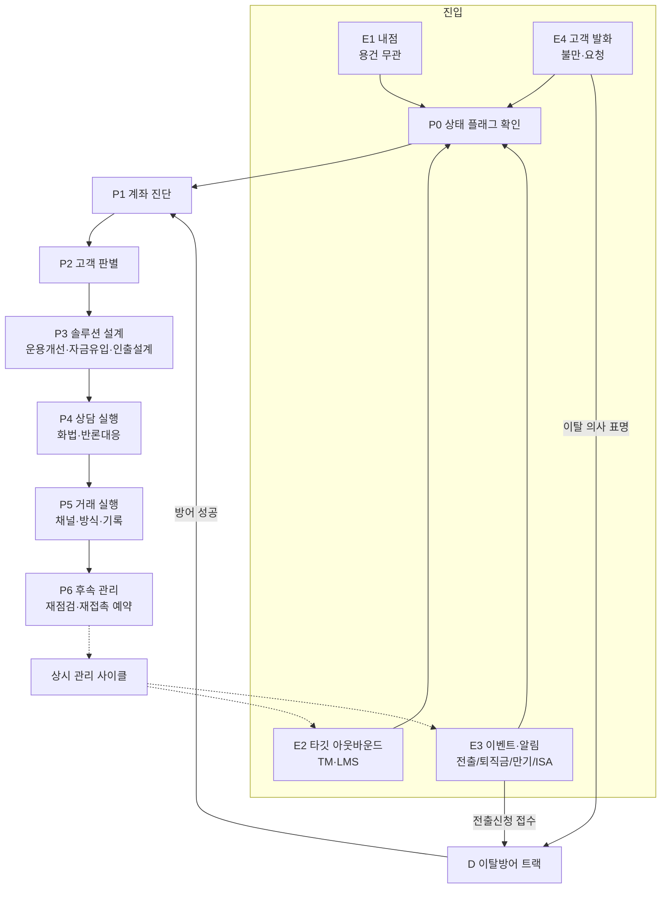

# 퇴직연금 사후관리 — 응대 코어 로직 (AS-IS 뼈대)

> 작성 2026-08-19 · 원천: 01~04 폴더 원본 전체 + 05_주제별_추출지식 5축
> **목적**: 에이전트 설계에 앞서, AS-IS 자료들이 암묵적으로 담고 있는 **"고객이 왔을 때부터 끝날 때까지"의 응대 로직 전체를 하나의 뼈대로 복원**한 문서.
> 이 뼈대가 확정된 뒤에 각 노드를 지식 단위(플레이/팩트/절차)로 분해한다.

**표기법**
- `[E1]` `[P3]` `[D2]` … : 로직 노드 번호 (진입 Entry / 공통단계 Phase / 이탈 Defense)
- 출처: `(보물지도 §…)` = 원본 문서, `(방법론 12)` = 05_주제별_추출지식/02_IRP관리방법론의 항목 번호 — 상세 근거·원문 인용은 그쪽에서 추적 가능
- `⚠` : 자료 간 상충 또는 미확정 — 문서 끝 「7. 미확정 지점」에 모음

---

## 1. 전체 조감도

AS-IS 자료를 관통하는 응대 구조는 **"진입 4경로 → 공통 엔진 7단계 → (이탈 국면이면) 방어 트랙"** 이며, 상담 밖에서는 **상시 관리 사이클**이 돌면서 진입 이벤트를 만들어낸다.



핵심 특징 세 가지:

1. **이탈방어는 별도 트랙이지만 같은 엔진을 쓴다.** 사전진단(D1)은 P1 진단의 재적용이고, 방어 성공 후에는 P1으로 되돌아와 정식 관리가 시작된다. "이탈은 관리 소홀의 결과"라는 인과(방법론 38·103)가 두 트랙을 하나로 묶는다.
2. **상담은 사이클의 한 바퀴일 뿐이다.** P6의 재접촉 예약과 상시 사이클(만기 안내, 월별 상품 갱신)이 다음 진입을 만든다. 자료 전체가 "일회성 캠페인이 아니라 상시 루틴"(보물지도 §보물지키기)을 반복 강조.
3. **모든 단계에 앞서 상태가 행동을 결정한다.** 연금개시 여부·진행 중 거래 같은 계좌 상태 플래그가 가능한 제안 자체를 제한하므로 P0이 최선두에 온다(방법론 59).

---

## 2. 진입 경로 — 상담이 시작되는 4가지 방식

### [E1] 내점 — 용건 무관 창구 방문

어떤 용건으로 왔든 표준 동작은 같다 (보물지도 §고객 만나면 꼭 챙기는 3가지 / 방법론 37·54):

1. 싱글뷰 확인 + **[04-10-099] 세금우대조회** (저축종류 36 연금저축 / 55 개인형IRP) — "청약·카드 조회하듯 습관화"
2. **[04-12-641]** 퇴직연금 보유현황 + **[06-12-151]** 납입한도·절세 여력
3. 결과에 따라 3분기:
   - **당행 IRP 보유** → P0~P1로 진입 (진단·관리 상담)
   - **연금저축 보유** → 만 55세·가입 5년 확인 후 이전 상담 (사후관리 범위 판단 필요 ⚠)
   - **정기예금·펀드 위주 운용 확인** → 리밸런싱 제안 대상 (Hot Tip 204309·205805)
4. 태도 원칙: **"파는 게 아니라 알려준다"** (보물지도)

### [E2] 타깃 리스트 아웃바운드 — TM·LMS·내점 유도

대상 조달 3경로 (Series1 §고객알기 / 보물지도 §타겟 / 신청서 51건):

- **본부 타겟리스트** (Info-zone > 타겟리스트): 리밸런싱 대상(고유대 50%↑ or 정기예금 100%), 이탈방지 대상(비대면 신규·권유직원 미존재) 등
- **오늘의할일 시트**: 세부요건(정량 조건)이 붙은 캠페인별 TM 대상 — 현금성 7,500만원↑(시트25), 성과저조 펀드(31), 원리금 100%(32), 성향 불일치(33), 만기임박+디폴트 미등록(34)
- **맞춤형 타깃 요청**: 영업점이 조건을 직접 정의해 본부에 요청 (`관리부점=… && 입금액<=1800만원` 수준의 형식 조건)

TM의 공통 골격은 **4단계 통화 구조 + 단계별 반론극복의 병렬 구조** (오늘의할일 전 시트 공통):

| 단계 | 본선 | 반론 분기 |
|---|---|---|
| 1 첫인사·본인확인 | 소속 안내, 본인 확인 | [본인 外 연결 시] 재통화 약속 or 종료 |
| 2 통화가능·관심유도 | 용건 한 줄 + "3분이면 가능한데" | [통화 불가 시] 재접촉 시각 약속 |
| 3 상세 안내 | 캠페인별 본문 (진단 결과 → 제안) | [거절극복] 사유별 대응 |
| 4 클로징 | 내점 예약 or 비대면 실행 연결 | [내점 불가 시] 방치의 손실 고지 + 여지 남기기 |

### [E3] 이벤트·알림 — 시스템이 만드는 진입

| 이벤트 | 기한(타이머) | 즉시 행동 | 출처 |
|---|---|---|---|
| **계약이전(전출) 신청 접수** | 의사확인 기한 내 (최단) | → **D 이탈방어 트랙** 직행. 단 전화보다 사전진단(D1) 먼저 | 보물지도 §이탈방어 |
| **퇴직금 IRP 입금** (쪽지) | 즉시 | 운용지시 여부 점검 → 미실행이면 P1 진단 대상 | 방법론 28, Hot Tip 206004 |
| **퇴직금 요구불통장 지급** | **60일** (과세이연 신청 기한) | 과세이연 재유입 상담 (P3-②) | 보물지도 §퇴직금, 방법론 27 |
| **ISA 만기** (도래 2~1개월 전 사전 + 해지금 입금 문자) | 만기 후 **60일** (전환 기한) | 전환 상담 (P3-②) | 보물지도 §추가납, Hot Tip 204287 |
| **원리금보장상품 만기 임박** | **1개월 전** (만기예약 가능 시점과 일치) | 만기 안내 = 재설계 상담 창구 (P3-①) | 보물지도 §관리수칙, 방법론 18·21 |

이벤트형의 공통 원리: **기한이 곧 우선순위다.** 60일·1개월 타이머가 붙은 순간 그 고객은 조회형 세그먼트보다 앞선다.

### [E4] 고객 발화 — 고객이 먼저 여는 상담

시스템이 미리 알 수 없고 **상담 중에만 관측**되는 진입 (05-01_고객세그먼트 33·50·57 / 방법론 39):

- "해지하고 싶다 / 돈이 필요하다" → 해지 방어 분기 (P3-③: 개시+부분인출 재설계)
- "수수료가 비싸다 / 증권사는 무료라던데" → 수수료 3분기 (D3 카드와 공유)
- "증권사로 옮기겠다 / ETF 하고 싶다" → 이탈 사유 분기 (D3)
- "IRP 계좌 하나 더 만들고 싶다" → 추가 개설 흐름도 (방법론 35)
- 반응·태도(불신형·차단형 등)는 상담 내내 화법 선택에 영향 (세그먼트 57)

**원칙: 발화를 듣기 전에 대안을 꺼내지 않는다** — 사유 특정이 분기 조건이므로 경청이 로직상 선행 노드다 (방법론 39).

---

## 3. 공통 엔진 — 7단계

### [P0] 상태 플래그 확인 — 가능한 행동부터 거른다

제안을 설계하기 전에 계좌 상태가 허용하는 행동을 확인한다 (방법론 59, Hot Tip 199404·203523):

| 상태 (확인 화면) | 막히는 행동 |
|---|---|
| 연금개시 / 연금지급설계 등록 ([02-12-223]) | 추가입금 불가, 타계좌 이전받기 불가 → 추가납 제안 금지 |
| 자동이체 입금·보유상품변경 진행 중 | 연금지급 등록 거래 불가 |
| 상품변경(만기상환·디폴트매수·ETF 체결) 중 | 실물이전 신청 거절됨 |
| 퇴직금 일부만 입금 | 전액 입금 전 이전 불가 |
| AI투자일임 운용 중 | 이전·연금지급·중도인출·해지 제한 |
| 위험자산 70% 초과 ([04-12-354]) | 별도 페널티는 없으나 조정 상담 대상 |

### [P1] 계좌 진단 — 무엇이 문제인가

진단의 표준 순서 (Series1 §고객알기 / 방법론 1~8):

1. **자산 3층 읽기**: 적립금을 ①고유계정대(현금성) ②원리금보장(만기·금리) ③실적배당(수익률)으로 나눠 금액·비중·만기·수익률까지 읽는다 ([04-12-642])
2. **오탐 제거**: 현금성자산이 보이면 접촉 전에 '사용계획 자금'인지 확인 — 1개월 이상 변동 없음 + 입금 사유가 교체매매·연금지급 아님 ([04-12-644]) (방법론 6·26)
3. **격차 진단**: 수익률은 절대값이 아니라 기준선 3개(IRP 평균 / 정기예금 평균 / 고유대 평균)와의 차이 = 방치의 기회비용으로 읽는다 (Series1 수치, ⚠시효)
4. **정합성 진단**: 투자성향 vs 실제 운용(예: 공격투자형 + 초저위험 등록)의 불일치 자체가 개선 근거 (방법론 5)
5. **만기 스캔**: 1개월 내 만기 도래 상품 → 재설계 창구 예약 (방법론 18)

진단 결과는 문제 유형으로 수렴한다: **방치(현금성) / 편중(원리금 100%) / 부진(환매추천 펀드) / 불일치(성향) / 저조(수익률)** — 2021년 A~D 유형 분류부터 2026년까지 같은 구조가 유지됨 (방법론 52).

### [P2] 고객 판별 — 누구에게 맞출 것인가

제안을 가르는 판별 축 4개:

1. **성향·경험 판별** — 두 방식이 병존 ⚠: ⓐ 펀드 이력 교차 확인(퇴직연금 [04-12-642] 전체기간 + 일반 공모펀드 [04-50-007] 폐기계좌 포함) → 안전자산 선호 / 분산투자 가능 (방법론 7, 2021계열) ⓑ 고객에게 직접 질문("실적배당 희망? 원리금보장 희망?") (Series1 Mission 스크립트, 2026)
2. **연령 × 투자가능기간** — 30·40대 수익 추구 / 50대 안정성 가미. 단 **일시금이 아니라 연금 수령 계획이면 투자가능기간을 수령 종료 시점까지 재산정** — 나이 기준 자동 분류를 막는 반전 조건 (방법론 61·62)
3. **자금 계획** — 일시금 vs 연금, 사용 시점 (해지·인출 상담의 분기 조건)
4. **잔여한도·납입 이력** — [06-12-151] 연합회 한도(당행+타행 합산), 필요시 국민지갑 확인서·[06-10-182] 집중조회 (방법론 24·55)

### [P3] 솔루션 설계 — 3개 설계 축

진단(P1)×판별(P2) 결과를 세 축의 설계로 변환한다. **한 고객에게 복수 축이 동시 적용될 수 있다** (E-E-T 구조상 셋은 연결됨 — 방법론 121).

**① 운용 개선 (리밸런싱)**

```
성향 분기 (P2-1)
├─ 안전자산 선호 → 상품군 유지, 금리만 상향: 특별제공 GIC·저축은행 예금·ELB
│   └ 제안 직전 확인: 이달 금리 > 보유 금리? / 만기별 금리 / 잔여한도 [04-12-17A] / 월말 매수 주의
├─ 분산투자 가능 → 포트폴리오 이동
│   ├ 투자 미경험·맡기고 싶음 → TDF (빈티지 = 출생연도+은퇴연령) / 디폴트옵션(등급 선택 = 배분)
│   ├ 직접투자·주식 관심 → ETF (주식형 70% + 채권혼합 30% 조합 등 ⚠)
│   └ 특정 테마 고집 → 90/10 원칙 or 이원화(테마는 다른 그릇, IRP는 기반자산)
└─ 고르기 어려워함 → 디폴트옵션(저위험 이상)을 표준 대안으로
```
- 실행 전 정량 검증: **중도해지 & 리밸런싱 계산기**로 "지금 바꿀지 만기까지 둘지" 비교 (방법론 19·77)
- 만기 임박 상품은 **만기예약변경**으로 제3의 선택지 제공 (방법론 21)

**② 자금 유입 설계**

```
잔여한도 확인 (당행+타행 합산)
├─ 세액공제 900만원 미달 → 사실 고지 → 자동이체 증액 → (거절 시) 추가입금 예약
├─ 900 충족 + 여력 있음 → 1,800만원까지: 과세이연·인출 시 과세제외·이연공제 3논거
├─ ISA 만기 (60일 내) → 한도 무관 전액 전환 + 10% 추가 공제 → 3년 순환 설계
├─ 퇴직금 통장 수령 (60일 내) → 과세이연 환급 5단계 절차
└─ 시니어 특례 → 다운사이징·기초연금수급자 양도차익 (6개월 내, 1억 한도)
※ 공통 제외: 연금개시 계좌 (P0 플래그)
```

**③ 인출·수령 설계**

```
연금개시 요건 확인 (만 55세 + 5년, 퇴직급여 포함 시 5년 면제)
├─ "해지하고 싶다" → 해지 대신 [개시 + 필요액만 인출] 재설계 (한도 내 30% 감면)
├─ 당장 돈 필요 없음 → 매년 1회 10만원 인출: 연차 적립 + 수수료 면제 + 감면율 상향 3중 효과
│   └ 챙기기 어려운 고객 → 금액지정 자동화 (단, ETF 보유자는 전량 매도 발생 ⚠ 순서 주의)
├─ 수령기간·시점 → 길게(20년 초과 50% 감면)·늦게(고령일수록 저율) + 문턱 3개(1,500만원·건보료·금소세)
├─ 퇴직 후 재취업 예정 → 3단 설계 (기존 개시 → 퇴직용 개설·개시 → 적립용 신규)
└─ 계좌 순서 규칙: 개시 전 이전 가능 상품 정리 / 세액공제 미신청금액 등록 [06-12-622] 선행
```

### [P4] 상담 실행 — 준비 → 접근 → 반론 → 축소

1. **준비 체크리스트** (방법론 8): 운용현황·수익률 / (상향 제안 시) 투자성향 / 대안 상품 스펙 / 현재 vs 대안 수익률 대비 / 비교그룹·추천 포트폴리오 / 중도해지 손실 / 잔여한도 — **준비가 끝나야 접촉한다**
2. **접근**: 지적이 아니라 개선 제안 (수익률 저조 고객은 민감 — 동일 연령대 상위 고객 대조, 72의 법칙 환산 등 간접 화법)
3. **반론 대응**: 반론 유형 → 승인 화법 매핑 (05-03_영업화법 102건이 이 노드의 재료). 근거 수치는 기준시점 병기
4. **거절 시 축소 재제안**: "일부만(500만~1천만원) + 마음에 안 들면 되돌릴 수 있음" — 전량 결정 부담과 비가역성 우려를 동시 해소 (방법론 20·79)
5. **클로징**: 실행 연결(P5) 또는 재접촉 예약 — "여지 남기기"까지가 표준 (오늘의할일 4단계)

### [P5] 거래 실행 — 채널 제약이 제안을 결정한다

| 경로 | 가능 | 제약 |
|---|---|---|
| 창구 | 전 거래 | 시간 소요 大, 투자상품 녹취 필요 → 앱 유도가 표준 |
| KB스타뱅킹 (자가) | 교체매매·만기예약·비대면전환 | **ETF는 고유대化 후 직접 매수** (대행 불가) |
| URL·모바일브랜치 발송 | 원격 교체매매 | 직원명·점코드 자동입력 안 됨 (수기 입력 안내 필수) |
| 전용상담센터 1599-0099 | 전화 운용변경 | **정기예금·고유대만** |
| 상담연계등록 [04-12-660] | 센터가 후속 연락 | 원리금 교체매매만, 마케팅 동의 필요 |

- 실행 방식: 보유상품 → **교체매매** / 만기 전 상품 → **만기예약변경** / 디폴트옵션 상향 → **반드시 2단계**(등록변경 + 보유상품변경) 사전 고지 / 디폴트옵션 등록은 **기존 고유대 교체매매와 세트**
- 실행 후: CRM 기록, 실적 등록 확인

### [P6] 후속 관리 — 다음 바퀴 예약

- **재점검 주기 약속**: 6개월~1년 수익률 점검 (Hot Tip 205805)
- **셀프 경로 교육**: 스타뱅킹 '나의 퇴직연금' 수익률 확인·상품변경 경로를 가르쳐 접촉 부담 없이 사이클 유지 (방법론 84)
- **재접촉 트리거 심기**: 만기예약, 요건 충족 시점 안내("만 55세 되시는 ○월에 다시"), 추가납 예약
- **전담 편입**: 권유직원 없는 계좌는 전담 지정 후 만기·수익률 관리 대상에 포함 (방법론 45)

---

## 4. 이탈방어 트랙 [D]

### [D0] 트리거
- 전출신청 접수 알림 (E3) — **알림 수신이 곧 발동, 시급성 최상**
- 상담 중 이탈 의사 표명 (E4)

### [D1] 통화 전 사전진단 4단계 (보물지도 §사전체크)
① 거래현황 [72-01-801] → ② 이전 유형 [06-AD-080] (현금이전=해지·환매 손실 / 실물이전=가능 상품 [06-AD-020]) → ③ 적립금·수익률 [04-12-642] → ④ **상품별 리스크 정량화** (원리금: 만기일·중도해지 손실 / 실적배당: 환매기간 기회손실 / 디폴트옵션: 매도손실). "전액현금대체" 표시 = 손실 최대 케이스.
**전화보다 계산이 먼저다** — 손실 수치 없이 통화하지 않는다.

### [D2] 통화 흐름 Step 01~06 (보물지도 §이탈방어 스크립트)
인사 → 통화가능 확인 → 목적 안내(**"저지"가 아니라 "진행 과정 안내 + 불편 확인"**) → 보유상품 리스크 안내 → **경청으로 사유 특정** → 사유별 대안(D3) → 결과 처리(D5)

### [D3] 사유별 대응 분기

| 사유 | 대응 골격 | 비고 |
|---|---|---|
| 비대면 이용 불만 | 개편 일정 안내 + 잔류 요청 | |
| **수수료 불만** | 고객 조건 3분기: 만55세↑→개시 시 면제 / 퇴직금 5천만↑→비대면 전환 면제 / 그 외→대면→비대면 전환 인하. + 가입기간 승계 비대칭 논거 | **조건으로 답이 결정되는 유일한 사유** |
| ETF 상품 다양성 | 인정 → 선별 제공·라인업 확대 → 미라인업은 대체상품 | ⚠ 종수 수치 통일 필요 |
| ETF 매매시간 | 라이선스 구조 설명 + 3분 체결(은행권 최속) + 감정매매 위험 재프레임 | |
| 수익률 불만 | 공시 1위 근거(기준시점 병기) + 보유 구성별 분기(원리금 100%→구성 설명·일부 전환 / 부진상품→사과·매도·재추천) + 장기 관리 약속 | |
| 관리 소홀 (현장 추가) | 화법이 아니라 **1:1 상담 서비스 연계**(1599-0099, 골든라이프) | 본부 5분류에 없음 ⚠ |
| VIP (등급 축) | 지위 인정 → 경청 → 사과 → 개선 서비스 제시 → 결정 유보 요청 | 사유와 직교하는 축 |
| 대출 동반 이전 | 대출(금리 상품)과 연금(관리 상품)의 판단 기준 분리 | |

### [D4] 추가 방어 카드
- 적립금에 **퇴직금 포함** → 주제를 인출·세금·건보료 설계로 전환 + 골든라이프센터 연계 (한 번 더 방어)
- 대형 계좌 → **중도해지 vs 만기 수령액 비교표** 제시 — 단 관리 소홀 인정·개선 약속이 먼저이며 **이 카드는 한 번만 통한다** (Hot Tip 203753)
- 최종 확인 통화 구간(알림톡·AI콜봇·무응답 자동취소)도 방어 기회 (방법론 107)

### [D5] 결과 처리
- **성공** → 직원 취소 3단계: 녹취 → [06-AD-080] 전출취소 → CRM 등록 (또는 고객 자가 취소 경로 안내) → **P1로 복귀해 정식 관리 시작** (방어는 관리 개선의 시간을 산 것)
- **실패** → 의사확인 프로세스(당일 알림톡 → 익일 AI콜봇 → 기한 내 미확인 시 자동취소) 안내 + "언제든 다시" 클로징
- **방어 불가 판단** → 차선책: KB증권 소개 (시너지 소개등록 필수) ⚠ 정책 판단 필요
- 이탈 완료 고객 → **재유치 대상 명단으로 전환** (3년 내 이탈 고객 — 세그먼트 20)

---

## 5. 상시 관리 사이클 — 상담 밖에서 도는 루프

**기본 4수칙** (보물지도 §기존고객관리, 상시):
① 지점 보유명세·만기·수익률 스캔 → ② 만기 1개월 전 안내 → ③ 저수익 고객 리밸런싱 제안 → ④ 대면계좌 비대면 전환 안내

**월간 리듬**: 매월 마지막 영업일 「다음달 특별제공상품 안내」 게시 → 월초 금리 확인 → 만기·재예치 상담 배치 (금리는 월 단위 확정 — 월말 매수 주의)

**연간 캘린더** (방법론 53·90·125):
- 1~3월: 퇴직금 지급 집중기 → **지급 방어** 우선 (지급 예정 조회 → 선제 접촉)
- 11~12월: 추가납 적기 (실질 마감 11월) → 본부 명단 수신 즉시 접촉, D-70 절세 점검
- 상시: 실물이전 시행 후 "시즌 개념 소멸" — 이탈방어는 연중 상수

**관리 기록**: 고액순 정렬 + 전담 지정, 접촉·제안·결과 기록(CRM), 관리 안 되는 계좌가 없도록 사각지대 점검

---

## 6. 로직을 관통하는 원칙 (불변식)

응대 로직 전체에 반복 등장하는 규칙 — 어느 단계에서든 위반하면 안 되는 것들:

1. **상태가 행동을 결정한다** — 제안 전 상태 플래그 확인 (P0). 상태를 안 읽으면 제안이 거래에서 튕긴다.
2. **진단 전 제안 금지, 경청 전 대안 금지** — 이탈 상담은 사유 특정이, 일반 상담은 계좌 진단이 제안에 선행한다.
3. **만기는 손실 없이 바꿀 수 있는 유일한 시점** — 만기를 재설계 창구로 쓰고, 방치하면 현금성자산이 된다. (반대 방향 활용: 유출 예상 계좌의 락인 ⚠ 정책 판단)
4. **유리함을 계산으로 검증한 뒤 제안한다** — 중도해지 계산기, 잔여한도, 이달 금리. "감"으로 권유하지 않는다.
5. **부분 전환 + 가역성** — 거절당하면 규모를 줄여 재제안. 첫 거래를 작게, 재접촉을 예약.
6. **일시금 vs 연금 계획 확인이 배분 판단에 선행한다** — "50대라서 안정형"을 막는 반전 조건.
7. **관리가 곧 이탈방어다** — 저수익 방치 → 불만 → 이탈의 인과. 방어 성공은 끝이 아니라 관리의 시작.
8. **기한(60일·1개월)이 우선순위를 만든다** — 타이머 붙은 고객이 조회형 대상보다 먼저다.
9. **컴플라이언스** — 고객 개인정보·거래정보(카드내역 등) 언급 금지 / 수익률 단정·보장 표현 금지("더 좋아질 것"이라 약속하지 않는다) / 대외비 자료 문구는 표현 변경, 수치는 기준시점 병기 / 용어: "고유계정대" 대신 "현금성자산"
10. **자동화 우선** — 디폴트옵션 등록은 기존 자금 교체매매와 세트, 자동이체·만기예약으로 사람이 안 챙겨도 돌아가게.

---

## 7. 미확정 지점 ⚠ — 뼈대에 뚫려 있는 구멍 (팀 결정 필요)

로직 구조는 자료 간 일치하지만, 아래 지점은 값·체계가 확정되지 않았다. 에이전트 구현 전 결정 필요:

| # | 미확정 사항 | 관련 노드 |
|---|---|---|
| 1 | 현금성자산 임계값 5종 병존 (10만/100만/1천만/7,500만/50%) — 목적별 기본값 지정 | E2, P1 |
| 2 | 이탈 사유 분류 체계 (본부 5유형 vs 현장 4유형 + VIP·대출 2축) 통합안 | D3 |
| 3 | 성향 판별 방식 (펀드 이력 교차 vs 직접 질문) — 병용 or 택일 | P2 |
| 4 | ETF 관점 상충: "40대 ETF 비권장"(교육) vs "ETF 100% 조합 활용"(현장) | P3-① |
| 5 | 수익률 '저조'의 정량 기준 부재 (2021 기준 실효) | P1 |
| 6 | ETF 종수·수수료·수익률 순위 등 시효 민감 수치의 기준시점 통일 | P4, D3 |
| 7 | KPI 동기 지식(득점 효율 순 접촉, 락인 유도, KB증권 소개)의 에이전트 반영 범위 | E2, D4, D5 |
| 8 | '연금개시 임박'의 정의 (요건 충족 몇 개월 전부터) | E3, P3-③ |
| 9 | 연금저축 이전 상담을 사후관리 범위에 포함할지 (유치 성격과 경계) | E1 |
| 10 | 방어 실패 후 재유치 접촉의 시점·조건 | D5 |

---

## 8. 다음 단계 — 이 뼈대에서 분해되는 산출물

뼈대가 확정되면 각 노드가 지식 단위의 목차가 된다:

| 뼈대 노드 | 분해 산출물 | 기존 자산 |
|---|---|---|
| E2·E3 진입 조건 | 조회형 트리거 정의 (기계 조건) | 05-01 세그먼트 + 신청서·오늘의할일 세부요건 |
| P0~P3 판단 규칙 | 진단·설계 규칙 카드 | 05-02 방법론 129건 |
| P4·D3 화법 | 상황별 승인 스크립트 | 05-03 화법 102건 |
| 전 노드의 수치 근거 | 팩트 (검증 기준 겸용) | 05-04 팩트 76건 |
| P5·D5 실행 | 화면·채널 절차 | 05-05 절차 74건 |
| 6장 불변식 | 상시 가드레일 | 각 문서 유의사항 + 컴플라이언스 |

즉 **05 축들은 버려지는 게 아니라, 이 뼈대의 각 노드에 재료를 공급하는 저장소**로 재배치된다. 노드 단위로 재료를 묶으면 앞서 논의한 "플레이" 단위가 자연스럽게 나온다.
