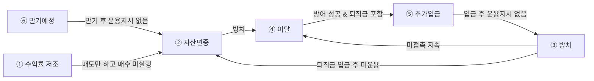

# 고객군 전체 지도 — 6종 한눈에 보기

> 자동 생성 문서 (`_generate_docs.py`) — 수정은 원본 YAML에서 하세요

사후관리 대상 개인형IRP 고객을 6개 군으로 나눴습니다.
고객군마다 **왜 지금 접촉하는가**와 **무엇을 제안하는가**가 다르고, 쓰는 화법도 다릅니다.

## 1. 6개 고객군 비교

| # | 고객군 | 한 줄 정의 | 1차 목적 |
|---|---|---|---|
| ① | **[수익률 저조](11_SEG-01_수익률저조.md)** | 적립금은 있으나 수익률이 기준선에 크게 못 미치는 고객 — 지적이 아니라 개선안으로 접근한다 | 수익률제고, 이탈방어 |
| ② | **[자산편중](12_SEG-02_자산편중.md)** | 적립금이 현금성자산·원리금보장상품 한쪽에 몰려 있는 고객 — 이탈률이 일반의 1.3배인 본부 최우선 관리군 | 수익률제고, 이탈방어 |
| ③ | **[방치](13_SEG-03_방치.md)** | 운용지시도 관리 접점도 없는 계좌 — 이탈 통보가 오기 전에 손을 대야 하는 유일한 구간 | 관리사이클, 이탈방어, 수익률제고 |
| ④ | **[이탈가능성 높음](14_SEG-04_이탈가능성높음.md)** | 전출 알림이 왔거나, 이탈 신호가 겹쳐 쌓인 고객 — 사유를 특정하기 전에는 대안을 꺼내지 않는다 | 이탈방어 |
| ⑤ | **[세액공제·추가입금](15_SEG-05_세액공제추가입금.md)** | 납입 여력이 남아 있는 고객 — 기한이 붙은 자금 이벤트(ISA·퇴직금 60일)가 최우선이고, 연금개시 계좌는 반드시 뺀다 | 자금유입 |
| ⑥ | **[예금·GIC 만기예정](16_SEG-06_예금GIC만기예정.md)** | 만기가 곧 재설계 창구인 고객 — 자동 재예치가 폐지돼 방치하면 만기자금이 그대로 현금성자산이 된다 | 수익률제고, 이탈방어, 관리사이클 |

### 권장 타겟 — 각 고객군을 어디까지 좁혔나

| 고객군 | 권장 타겟 조건 |
|---|---|
| ① 수익률 저조 | 적립금 300만원 이상 AND (원리금보장 100% 운용 OR 환매추천펀드 보유) AND 1년 수익률이 당행 IRP 평균 대비 -5%p 이상 열위 |
| ② 자산편중 | 적립금 1천만원 이상 AND 고유계정대 보유비율 50% 이상 AND 1개월 이상 금액 변동 없음 AND 입금사유가 교체매매·연금지급이 아님 |
| ③ 방치 | 퇴직금 입금 후 운용지시 미실행 계좌 (1순위) → 비대면 신규 & 권유직원 부재 & 적립금 1천만원 이상 (2순위) |
| ④ 이탈가능성 높음 | ① 전출 알림 수신 계좌 전건(즉시) ② 신호 2개 이상 중첩 & 적립금 1천만원 이상(예방) |
| ⑤ 세액공제·추가입금 | ① ISA 만기 D-60 ~ 만기 후 60일 이내(기한 트랙, 최우선) ② 최근 3년 납입 이력 & 당해 잔여한도 보유(습관 트랙) — 두 트랙 모두 연금개시·연금지급설계 계좌 제외 |
| ⑥ 예금·GIC 만기예정 | 만기 D-30 이내 원리금보장상품 10만원 이상 보유 AND 디폴트옵션 미등록 (1순위) → 디폴트옵션 등록 완료 계좌 중 만기 D-30 (2순위, 재예치 금리 상향 목적) |

### 규모

| 고객군 | 지식 | 시나리오 | 임계값 변형 | 미결 과제 |
|---|---|---|---|---|
| ① 수익률 저조 | 27 | 3 | 2 | 3 |
| ② 자산편중 | 40 | 3 | 6 | 3 |
| ③ 방치 | 31 | 3 | 4 | 3 |
| ④ 이탈가능성 높음 | 36 | 4 | 3 | 4 |
| ⑤ 세액공제·추가입금 | 31 | 3 | 4 | 4 |
| ⑥ 예금·GIC 만기예정 | 40 | 3 | 4 | 3 |

## 2. 한 고객이 여러 군에 걸릴 때 — 무엇을 먼저 보나

실제 고객은 대부분 2개 이상에 해당합니다. 아래 순서로 판정합니다.

| 순위 | 고객군 | 이 조건이면 | 왜 먼저인가 |
|---|---|---|---|
| 1 | ④ 이탈가능성 높음 | 전출 알림이 수신된 경우 | 이벤트형이고 기한이 있다 — 다른 모든 고객군에 우선한다 |
| 2 | ⑤ 세액공제·추가입금 | ISA 만기·퇴직금 60일 타이머가 돌고 있는 경우 | 지나면 기회가 소멸한다 (기한 > 조회형) |
| 3 | ⑥ 예금·GIC 만기예정 | 만기 D-30 상품이 있는 경우 | 고객이 이상하게 여기지 않는 접촉 명분이고, 방치 시 SEG-02·03으로 전이된다 |
| 4 | ② 자산편중 | 편중 조건에 해당하는 경우 | 이탈률 1.3배 — 예방 트랙 중 근거가 가장 강하다 |
| 5 | ① 수익률 저조 | 수익률 격차가 큰 경우 | 원인(구성/상품)이 특정될 때만 제안이 나온다 |
| 6 | ③ 방치 | 위 어느 것에도 안 걸리지만 접점이 없는 경우 | 상시 트랙 — 관계 형성 자체가 목적 |

원칙은 **기한이 붙은 것 먼저**입니다 — 전출 알림·ISA 60일·퇴직금 60일·만기 D-30은
지나면 기회가 소멸하지만, 편중·수익률·방치는 다음 달에도 그대로 있습니다.

## 3. 고객군은 서로 옮겨간다 (방치했을 때의 전이)

고객군은 고정된 속성이 아니라 **상태**입니다. 손대지 않으면 아래로 흘러갑니다.

| 출발 | 도착 | 무엇이 방아쇠인가 | 설명 |
|---|---|---|---|
| ⑥ 예금·GIC 만기예정 | ② 자산편중 | 만기 후 운용지시 없음 | 자동 재예치 폐지로 만기자금이 현금성자산으로 상환된다 |
| ③ 방치 | ② 자산편중 | 퇴직금 입금 후 미운용 지속 | 금액이 커서 즉시 편중 계좌가 된다 |
| ② 자산편중 | ④ 이탈가능성 높음 | 편중 상태 방치 | 이탈위험도 1.3배 |
| ③ 방치 | ④ 이탈가능성 높음 | 미접촉 지속 | 관리되지 않은 계좌의 이탈은 막을 수 없다 |
| ① 수익률 저조 | ② 자산편중 | 부진 펀드 매도만 하고 매수 미실행 | 매도 대금이 현금성자산으로 남는다 |
| ④ 이탈가능성 높음 | ⑤ 세액공제·추가입금 | 방어 성공 & 퇴직금 포함 | 인출 설계 상담으로 이어진다 |
| ⑤ 세액공제·추가입금 | ③ 방치 | 입금 후 운용지시 없음 | 자금이 들어와도 운용되지 않으면 방치다 |

이 표가 말하는 것은 하나입니다 — **이탈방어의 진짜 시점은 이탈 통보 전이고,**
**그 앞단이 만기·방치·편중입니다.**

## 4. 어느 고객군에서도 공통으로 빼는 것

| 제외 조건 | 적용 고객군 | 근거 |
|---|---|---|
| 연금개시·수령 중 계좌 | ①, ②, ③, ⑤, ⑥ | `KU-G-002` 연금개시 중·수령 예정 고객에게 투자상품을 권유하지 않는다 |
| '연금지급설계' 등록 계좌 (추가납 한정) | ⑤ | `KU-G-011` 연금개시·연금지급설계 등록 계좌에 추가입금을 권유하지 않는다 |
| PB센터 관리고객 (본부 TM 명세 기준) | ①, ② | `KU-M-010` 성과저조·환매추천 펀드 보유 고객 — 사과 후 매도·재추천이라는 구체 액션 |
| 계좌 상태 제약 — 상품변경 진행중·환매불가·퇴직금 미입금 | ④ | `KU-M-016` 실물이전 불가·거절 계좌 상태 5분류 — 계약이전 대상의 실행 가능성 필터 |

## 5. 전 고객군 공통 금지

| 금지 | 적용 고객군 수 | 요지 |
|---|---|---|
| `KU-G-005` 수익률·순위는 기준시점·비교모집단·출처를 붙여서만 말한다 | 6 | 금지: "저희가 1위예요", "약 0.2%쯤", 미래 수익률 단정. |
| `KU-G-002` 연금개시 중·수령 예정 고객에게 투자상품을 권유하지 않는다 | 4 | 금지: 연금개시 중이거나 수령 예정인 고객에게 적립식 분산투자·투자상품 편입 권유. |
| `KU-G-003` 비대면(전화·문자)에서 특정 펀드를 권유하지 않는다 — 금소법 | 3 | 금지: 통화·문자에서 특정 펀드상품명을 언급한 권유. |
| `KU-G-004` 내부 용어를 고객에게 쓰지 않는다 — '고유계정대' → '현금성자산' | 3 | 금지: "고유계정대", "고유대", "미운용자산" 같은 내부 용어. |
| `KU-G-013` KPI 실적 인정 요건을 고객 이익 논거로 바꿔 말하지 않는다 | 3 | 금지: "1천만원 이상 저축은행이나 TDF로 바꾸셔야 해요"처럼 인정 요건을 그대로 옮기는 것. |

## 6. 데이터 요건 통합 — 어느 필드가 어느 고객군에 쓰이나

타깃 추출 시스템에 필요한 필드 목록입니다.

| 데이터 필드 | 쓰는 고객군 |
|---|---|
| `적립금_평가금액` | ① ② ⑥ |
| `최근접촉일자` | ① ③ ④ |
| `계좌개설유형(대면/비대면)` | ② ④ |
| `디폴트옵션_등록여부` | ② ③ |
| `중도해지_예상손실액` | ④ ⑥ |
| `투자성향분석결과` | ① ② |
| `ISA_만기일·만기해지일` | ⑤ |
| `계약이전_전출신청_상태·접수일` | ④ |
| `계좌_1년수익률` | ① |
| `계좌개설경로(대면/비대면)` | ③ |
| `고유계정대_금액` | ② |
| `고유계정대_보유비율` | ② |
| `권유직원_존재여부` | ③ |
| `금융소득종합과세_대상여부` | ⑤ |
| `당월_특별제공상품_금리` | ⑥ |
| `당해_세액공제_잔여한도` | ⑤ |
| `디폴트옵션_등록여부·등급` | ⑥ |
| `만기도래금액` | ⑥ |
| `만기일·만기잔여일수` | ⑥ |
| `만연령` | ① |
| `보유상품_상품명·유형(정기예금/GIC/ELB)` | ⑥ |
| `보유상품별_만기일·수익률` | ④ |
| `보유펀드_수익률` | ① |
| `상품구성_3층(현금성/원리금보장/실적배당)` | ① |
| `스타클럽등급` | ④ |
| `시중은행정기예금_금액` | ② |
| `실물이전_가능여부` | ④ |
| `연금개시여부` | ⑤ |
| `연금지급설계_등록여부` | ⑤ |
| `연도별_납입금액(23/24/25/26)` | ⑤ |
| `연합회_한도(타사 포함)` | ⑤ |
| `운용지시_금액(적립금 대비)` | ③ |
| `운용지시_실행여부` | ③ |
| `원리금보장상품_비중` | ② |
| `이전유형(현금/실물)` | ④ |
| `자기부담금_당해_누적액` | ⑤ |
| `전담직원_지정여부` | ③ |
| `전입이력` | ④ |
| `총급여구간(세액공제율 판정)` | ⑤ |
| `최근입금사유` | ② |
| `퇴직금_입금여부·입금일` | ③ |
| `퇴직금_지급일` | ⑤ |
| `퇴직금_포함여부·금액` | ④ |
| `투자성향·펀드이력` | ⑥ |
| `현금성자산_금액` | ③ |
| `현금성자산_최근1개월_변동여부` | ② |
| `현재_적용금리` | ⑥ |
| `환매추천펀드_해당여부` | ① |

## 7. 조회 화면 통합

| 화면 | 이름 | 쓰는 고객군 |
|---|---|---|
| `[04-12-642]` | 적립금 및 수익률 조회 | ① ② ⑥ |
| `[04-12-644]` | 퇴직연금 거래내역 조회 | ② ③ ⑤ |
| `[04-12-17A]` | NEW 퇴직연금상품조회 | ② ⑥ |
| `[04-12-657]` | 미운용 현금성자산 부점 일괄 조회 | ② ③ |
| `[01-12-213]` | ISA 만기자금 입금 | ⑤ |
| `[02-12-223]` | 연금개시 여부 확인 | ⑤ |
| `[04-10-099]` | 세금우대관련조회 | ⑤ |
| `[04-12-333]` | 실물이전상품 대조 | ④ |
| `[04-12-613]` | 수수료 관리 > 수수료 예상조회 | ④ |
| `[04-12-646]` | 개인형IRP 이체목록 | ④ |
| `[04-50-007]` | 공모펀드 조회(폐기계좌 포함) | ① |
| `[06-12-151]` | 개인부담금 연합회 한도 조회 | ⑤ |
| `[06-12-622]` | 세액공제 미신청금액 등록 | ⑤ |
| `[06-12-625]` | 권유직원 정정 | ③ |
| `[06-12-631]` | 퇴직연금 고객포털 > 퇴직연금 컨설팅 | ① |
| `[06-AD-020]` | 실물이전 가능여부 결과조회 | ④ |
| `[06-AD-080]` | 전출조회 / 전출취소(해제) | ④ |
| `[72-01-801]` | 개인싱글뷰조회 | ④ |
| `[75-08-110]` | 콘텐츠 지정 발송 | ⑥ |
| `[75-08-430]` | 고객별 발송조회 | ③ |
| `경영정보시스템` | 영업지원 > 실적관리 > 수신상품(퇴직연금) | ⑥ |

## 8. 기획 확인이 필요한 것 (전체)

**① 수익률 저조**

- [ ] '수익률 저조'의 정량 임계값 — 현행 본부 기준이 없어 팀 정의 필요 (SEG doc 10번)
- [ ] 환매추천펀드 목록의 현행 운영 여부 (분기별 갱신 여부) — SEG doc 8번 검토메모
- [ ] [06-12-631] 비교그룹 조회 화면의 현행 여부 — 2021~22년 자료 기반

**② 자산편중**

- [ ] 다섯 갈래 임계값 중 목적별 기본값 확정 (SEG doc 3·40·41번)
- [ ] 부산역지점 확장 조건(디폴트옵션 안정형 합산) 채택 여부 (SEG doc 1번)
- [ ] 매도 우선순위 4단이 본부 공식 규칙인지 (SEG doc 42번)

**③ 방치**

- [ ] '방치' 판정의 경과기간 기준 (미접촉 6개월? 미운용 1개월?) — 팀 정의 필요
- [ ] 디폴트옵션 미지정 잔존 고객의 현재 규모·특성 (SEG doc 7번)
- [ ] '관리 접점 부재 = 이탈 고위험' 인과는 정리자 해석 — 본부 확인 필요 (SEG doc 11번)

**④ 이탈가능성 높음**

- [ ] 이탈 신호 중첩 2개 기준은 정리자 제안 — 실제 이탈률로 검증 필요
- [ ] 본부 관점(ETF 보유자=위험군)과 현장 관점(ETF 미보유자=잠재군)이 정반대 모집단 (SEG doc 34번)
- [ ] KB증권 보전율 70% vs 80% 상충 (SEG doc 39번 / 화법 35번)
- [ ] '과거 가입기간 미인정·장기할인 소멸'은 타사 정책 주장 — 사실 확인 후에만 사용

**⑤ 세액공제·추가입금**

- [ ] '최근 3년 납입 이력'의 정의 확정 (SEG doc 13번)
- [ ] ISA 전환 추가공제 한도 — '최대 300만원'과 총급여 구간별 상세값(300만원/1,388,000원) 중 현행 확인 (SEG doc 45번)
- [ ] 세액공제 미신청금액 등록 화면 [06-12-622] / [06-12-627]·[06-12-651] 갈림 — 현행 확인
- [ ] '연금지급설계' 등록 여부의 조회 화면이 자료에 없음

**⑥ 예금·GIC 만기예정**

- [ ] '익월 만기금액 1천만원 이상' 금액 기준의 현행 여부 (SEG doc 9번)
- [ ] 저축은행 3년제가 디폴트옵션 초저위험보다 금리가 높다는 서술과 KBthink 서술의 비교 대상 상충 (화법 71번)
- [ ] 매도 우선순위 4단이 시스템 계산기 순위인지 본부 공식 규칙인지 (SEG doc 42번)

---

**고객군별 상세 문서**

- ① [수익률 저조](11_SEG-01_수익률저조.md) — 적립금은 있으나 수익률이 기준선에 크게 못 미치는 고객 — 지적이 아니라 개선안으로 접근한다
- ② [자산편중](12_SEG-02_자산편중.md) — 적립금이 현금성자산·원리금보장상품 한쪽에 몰려 있는 고객 — 이탈률이 일반의 1.3배인 본부 최우선 관리군
- ③ [방치](13_SEG-03_방치.md) — 운용지시도 관리 접점도 없는 계좌 — 이탈 통보가 오기 전에 손을 대야 하는 유일한 구간
- ④ [이탈가능성 높음](14_SEG-04_이탈가능성높음.md) — 전출 알림이 왔거나, 이탈 신호가 겹쳐 쌓인 고객 — 사유를 특정하기 전에는 대안을 꺼내지 않는다
- ⑤ [세액공제·추가입금](15_SEG-05_세액공제추가입금.md) — 납입 여력이 남아 있는 고객 — 기한이 붙은 자금 이벤트(ISA·퇴직금 60일)가 최우선이고, 연금개시 계좌는 반드시 뺀다
- ⑥ [예금·GIC 만기예정](16_SEG-06_예금GIC만기예정.md) — 만기가 곧 재설계 창구인 고객 — 자동 재예치가 폐지돼 방치하면 만기자금이 그대로 현금성자산이 된다

*원본 데이터: [`10_세그먼트.yaml`](10_세그먼트.yaml) 외 — 이 문서는 `_generate_docs.py`로 생성됩니다.*
