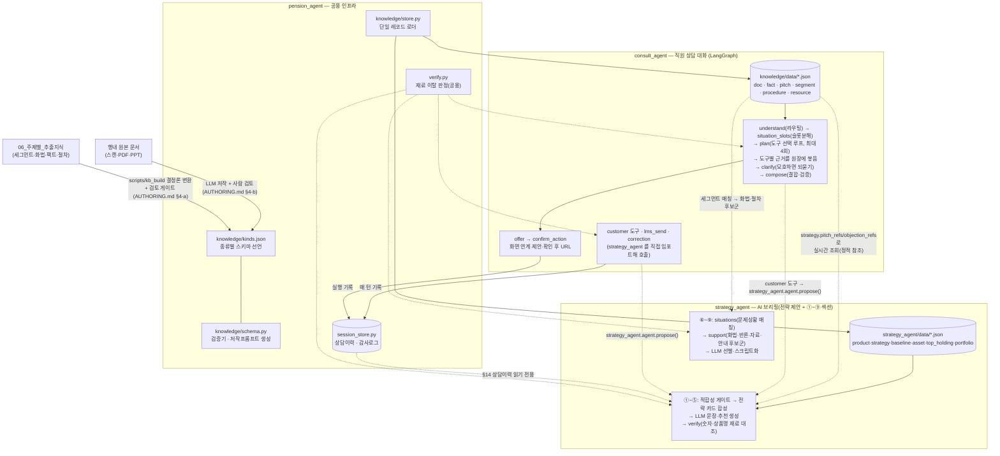

# 퇴직연금 에이전트 (Pension Agent)

퇴직연금(IRP) 상담 전, 직원에게 **이 고객에게 무엇을 어떻게 제안할지**를 정리해 주는
에이전트 묶음. **코드가 사실을 확정하고 LLM은 표현만 맡는** 구조라, 규제 도메인에서
환각·불완전판매를 구조적으로 막는다.

요건(화면 ①~⑨ · 상담이력 등)의 기준은 [../docs/REQUIREMENTS.md](../docs/REQUIREMENTS.md)
하나다. 코드 주석은 외부 기획안·목업을 직접 인용하지 않고 이 문서를 가리킨다.

## 디렉토리

```
src/
├─ pension_agent/          ← 임포트 가능한 단일 패키지. 모든 임포트가 여기서 시작한다
│  ├─ config.py            경로·데이터 위치의 단일 출처
│  ├─ llm.py               프로바이더 전환식 LLM 클라이언트 (환경 이전 시 여기만 수정)
│  ├─ verify.py            LLM 산출물의 재료 이탈 판정 — 두 에이전트 공통
│  ├─ session_store.py     상담 세션·대화이력 (consult 가 쓰고 strategy 가 읽는다)
│  ├─ tools.py             외부 연동 레지스트리 (LMS 발송 — 되돌릴 수 없는 행위의 게이트)
│  ├─ knowledge/           데이터 접근 계층 — kinds·schema·store·similarity·checks + data/
│  ├─ strategy_agent/      AI 브리핑 — 고객 1명 종합 → ①~⑨ 섹션
│  │  └─ engine/           결정적 처리 계층 9개 모듈 (catalog·products·scoring·pipeline…)
│  ├─ consult_agent/       직원 상담 대화 (LangGraph) — state·routing·graph + nodes/
│  └─ market/              시황·금리 소스 (자리표시자)
├─ tests/                  회귀 테스트 5종 + debug/(실행 트레이스 — 운영 코드 무수정)
├─ scripts/                개발 스크립트 — kb_build(지식 변환) · demo_status(리포트)
├─ app.py                  Streamlit 평가 대시보드 (개발·테스트용 화면)
├─ requirements.txt
├─ .env                    공용 LLM 설정 (커밋 금지) · .env.example 참고
└─ AUTHORING.md            데이터 소스 추가 가이드 (사내 규정·상품 등 + 저작 프롬프트)
```

향후 `knowhow_agent/`(영업 노하우)도 `pension_agent/` 아래 같은 방식으로 붙는다.

**임포트는 전부 절대 경로다** — `from pension_agent.strategy_agent import engine`. 모듈이
`sys.path` 를 손대는 곳은 한 군데도 없고, 경로를 아는 파일은 `config.py` 하나다.
`tests/test_infra.py` 가 이 두 가지를 회귀로 고정한다.

## 실행 · 테스트

아래 명령은 전부 `src/` 에서 실행한다.

```bash
pip install -r requirements.txt
cp .env.example .env      # 사내 GenAI 게이트웨이 URL·키 입력 (pension_agent/llm.py 가 읽음)
```

```bash
# ── 실행
python -m pension_agent.strategy_agent.agent 이준호            # 단일 고객 AI 브리핑 (CLI)
python -m pension_agent.consult_agent -c 198734-1205842        # 대화형 REPL — 고객 화면이 열린 상태
streamlit run app.py                                   # 평가·피드백 대시보드 (+대화형 에이전트 테스트 탭)

# ── 테스트 (LLM 키 없이 동작)
python -m tests.test_engine                     # 엔진 감사 회귀 (①~⑤ 결정론 로직)
python -m tests.test_support                    # ⑥~⑨ 문제상황·후보군·더미 규약·시효성 수치
python -m tests.test_strategy_agent             # LLM 산출 검증·폴백 경로
python -m tests.test_consult_agent              # 검색·라우팅·즉답 의도·도구 루프
python -m tests.test_infra                      # 공용 인프라(세션·도구·임포트 경계)
python -m tests.debug.test_trace                # 실행 트레이스 — 노드·게이트·폐기 사유
python -m scripts.kb_build.test_paths           # 경로·locator 실재 (폴더 재번호 회귀)

# ── 진단: 이 답이 어느 노드에서 어떻게 나왔나 (tests/debug — 운영 코드를 고치지 않는다)
# 인자 규약이 위 REPL 과 같다. 평소 쓰던 줄의 모듈 이름만 바꾸고 --debug 를 붙이면 된다.
CAD="python -m tests.debug"
$CAD --debug "세액공제 한도가 얼마야?"                  # 단발 + 트레이스
$CAD --debug -c 198734-1205842                          # REPL + 턴마다 트레이스
$CAD --debug -c 198734-1205842 "이 고객 투자성향 뭐야?" "그럼 만기 자금은?"  # 멀티턴
$CAD --script tax_credit_known_wrong --debug --show-llm  # 키 없이 재현(캔드 LLM)
$CAD --list                                              # 시나리오 목록
# -c 값은 손대지 않고 그대로 넘어간다. 다만 이 체크아웃에 없는 id 면 시작할 때 끊고 있는
# id 를 알려준다 — 없는 id 는 에러 없이 '재료 0건' 이 돼서 오타와 구분되지 않기 때문이다.
# 그대로 넘기려면 --any-customer (트레이스 맨 위에 경고가 남는다).

# ── 무결성 점검
python -m pension_agent.strategy_agent.engine   # 전략 정의 검증 — 근거 교차검증 포함
python -m pension_agent.consult_agent.kb        # 지식베이스 점검 리포트 (ERROR 0 확인)
python -m pension_agent.knowledge.schema validate pension_agent   # 전 데이터 검증

# ── 지식베이스 재생성 (06_주제별_추출지식 원문을 고친 뒤)
python -m scripts.kb_build.build_kb             # _draft_ 로 생성 + 변환 리포트
python -m scripts.kb_build.build_kb --activate  # 검토 후 활성화

# ── 데모 점검 리포트 (무엇이 더미이고 무엇이 소스 미확정인지)
python -m scripts.demo_status                   # docs/DEMO_STATUS.md 갱신
```

전부 `src/` 에서 `-m` 으로 실행한다 — 그래야 `src/` 가 임포트 루트가 되어 `pension_agent`
패키지를 찾는다. 설치(`pip install -e .`)는 필요 없다.

대화형 에이전트는 `-c/--customer` 로 "지금 열려 있는 고객"을 지정한다. 넘기지 않으면
브리핑질의·LMS발송·수정 세 의도가 "고객 화면을 먼저 열어주세요"로 답한다. 고객 id(KB-PIN)
목록은 `pension_agent/strategy_agent/customer.py` 의 `PERSONAS` 참고(예: 이준호=
`198734-1205842`) — 원장은 `customers.json`(scripts/import_customers.py 산출물)이다. 자세한 실행
조합은 [pension_agent/consult_agent/README.md](pension_agent/consult_agent/README.md).

LLM 은 `.env` 의 `LLM_BASE_URL` 유무로 사내(genai)/외부테스트(anthropic)를 자동 전환한다 →
[pension_agent/README.md](pension_agent/README.md).

## 구조



## 핵심 설계

- **코드 = 사실 / LLM = 표현.** 수치·상품·적합성은 코드가 정하고 LLM은 문장만 쓴다. 모든 LLM
  산출은 `pension_agent/verify.py` 가 재료(숫자·상품명) 이탈을 대조하고, 실패하면 규칙 결과를 남기거나
  섹션을 비운다 — 규칙 문장을 AI 산출로 오인시키지 않는다.
- **저작은 검증을 통과해야 활성화된다.** 원본 문서를 LLM이 `kinds.json` 종류(kind)의 JSON으로
  뽑고, 사람이 검토한 뒤 `schema.py` 검증기(필수필드·enum·참조·사실충돌·개인정보 패턴)를 통과해야
  적재된다. 모든 데이터가 `{meta, records:[{id, kind, fields, …}]}` 단일 규격이라 새 데이터·새
  종류는 파일/선언만 추가하면 붙는다 → [AUTHORING.md](AUTHORING.md).
- **검색의 불확실성을 브리핑에 들이지 않는다.** strategy_agent 는 화법 카드를 검색하지 않고,
  저작 시점에 연결해둔 `pitch_refs`/`objection_refs` 를 요청마다 실시간 조회한다(복사하지 않으므로
  원본과 어긋나지 않는다). 상담이력도 같은 단방향 원칙 — consult_agent 가 쓰고 strategy_agent 는
  읽기만 한다.
- **화면 제목은 한 곳에서 정한다.** ①~⑨ 섹션의 제목·생성주체는 `strategy_agent/sections.py` 가
  유일한 출처이고, CLI·Streamlit 이 전부 여기서 읽는다.
- **외부 연동은 도구 레지스트리로 갈아끼운다.** LMS 발송 등은 `pension_agent/tools.py` 스텁으로 자리를
  잡아두고, MCP 연동 시 함수 본문만 교체한다 — 라우팅 로직은 손대지 않는다.
- **되돌릴 수 없는 행위는 제안하고 실행은 사람이 정한다.** 에이전트가 문맥을 보고 도구 호출을
  판단하되(`act.offer`), 발송처럼 대외로 나가는 것은 직원의 확인을 한 턴 거친 뒤 실행한다
  (`act.confirm_action`). 제안 여부도 규칙으로 정한다 — 매 턴 물으면 확인 절차가 의미를 잃는다.
- **⑥~⑨ 는 전략이 아니라 문제상황에서 출발한다.** 06/01 고객세그먼트를 요건 판정 결과와 대조해
  "이 고객이 왜 관리 대상인가"를 먼저 확정하고, 그 사유에 맞는 화법·반론·자료·안내 콘텐츠를
  모은다. 관리 사유가 없는 고객은 비운다 — 사유를 만들어내지 않는다.
- **출처는 원본 문서 이름으로 말한다.** 모든 카드가 `source.doc`(또는 파일 단위 선언인
  `meta.source_doc`)으로 원천 문서 레지스트리(`doc` kind)를 가리키고, 화면·답변은 그것을 조인해
  문서명·부서·기준시점을 함께 보여준다. 출처 문자열을 만드는 곳은 `consult_agent/kb.py::origin_of()`
  하나이고, **적재 json 의 이름표로는 절대 물러서지 않는다** — 못 찾으면 원문 표기·추출지식 절을
  거쳐 "확인 필요"라고 말한다. 지어내지 않는다.
- **편집 가능 범위는 코드가 못박는다.** 브리핑 수정은 `strategy_agent.agent.EDITABLE_FIELDS`
  (LLM이 쓴 산문)만 허용하고, 코드가 계산한 수치·상품명은 대화로 못 고친다. 승인된 수정도 이번
  세션의 감사로그로만 남는다(재적용 루프는 다음 단계).
