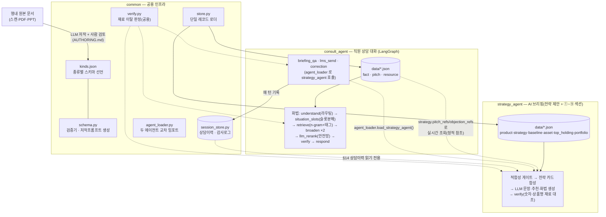

# 퇴직연금 에이전트 (Pension Agent)

퇴직연금(IRP) 상담 전, 직원에게 **이 고객에게 무엇을 어떻게 제안할지**를 정리해 주는
에이전트 묶음. **코드가 사실을 확정하고 LLM은 표현만 맡는** 구조라, 규제 도메인에서
환각·불완전판매를 구조적으로 막는다.

요건(화면 ①~⑨ · 상담이력 등)의 기준은 [../docs/REQUIREMENTS.md](../docs/REQUIREMENTS.md)
하나다. 코드 주석은 외부 기획안·목업을 직접 인용하지 않고 이 문서를 가리킨다.

## 디렉토리

```
src/
├─ common/          공용 인프라 — LLM 클라이언트 · 데이터 규격(store·schema·kinds) · 세션이력 · 두 에이전트 교차 로더
├─ consult_agent/   직원 상담 대화 에이전트 — 화법 코칭 · 브리핑 질의 · LMS 발송 · 브리핑 수정 (LangGraph)
├─ strategy_agent/  AI 브리핑 에이전트 — 고객 1명 종합 → ①~⑨ 섹션 (+평가 대시보드)
├─ market/          시황 소스 — 뉴스·금리를 지식으로 정제 (플레이스홀더)
├─ .env             공용 LLM 설정 (커밋 금지) · .env.example 참고
└─ AUTHORING.md     데이터 소스 추가 가이드 (사내 규정·상품 등 + 저작 프롬프트)
```

향후 `knowhow_agent/`(영업 노하우)도 같은 방식으로 붙는다.

## 실행 · 테스트

아래 명령은 전부 `src/` 에서 실행한다.

```bash
cp .env.example .env      # 사내 GenAI 게이트웨이 URL·키 입력 (common/llm.py 가 읽음)
```

```bash
# ── 실행
python strategy_agent/agent.py 이현우           # 단일 고객 AI 브리핑 (CLI)
streamlit run strategy_agent/app.py             # 평가·피드백 대시보드 (+대화형 에이전트 테스트 탭)
python consult_agent/graph.py -c C3             # 대화형 에이전트 REPL — 고객 화면이 열린 상태

# ── 테스트 (LLM 키 없이 동작)
python strategy_agent/test_engine.py            # 엔진 감사 회귀 632건
python strategy_agent/test_agent.py             # LLM 산출 검증·폴백 경로
python consult_agent/test_agent.py              # 검색·라우팅
python common/test_common.py                    # 공용 인프라(스키마·검증·세션)
python consult_agent/kb.py                      # 지식베이스 점검 리포트 (ERROR 0 확인)
```

대화형 에이전트는 `-c/--customer` 로 "지금 열려 있는 고객"을 지정한다. 넘기지 않으면
브리핑질의·LMS발송·수정 세 의도가 "고객 화면을 먼저 열어주세요"로 답한다. 고객 id 목록은
`strategy_agent/customer.py` 의 `PERSONAS` 참고(예: 이현우=`C3`). 자세한 실행 조합은
[consult_agent/README.md](consult_agent/README.md).

LLM 은 `.env` 의 `LLM_BASE_URL` 유무로 사내(genai)/외부테스트(anthropic)를 자동 전환한다 →
[common/README.md](common/README.md).

## 구조



## 핵심 설계

- **코드 = 사실 / LLM = 표현.** 수치·상품·적합성은 코드가 정하고 LLM은 문장만 쓴다. 모든 LLM
  산출은 `common/verify.py` 가 재료(숫자·상품명) 이탈을 대조하고, 실패하면 규칙 결과를 남기거나
  섹션을 비운다 — 규칙 문장을 AI 산출로 오인시키지 않는다.
- **저작은 검증을 통과해야 활성화된다.** 원본 문서를 LLM이 `kinds.json` 종류(kind)의 JSON으로
  뽑고, 사람이 검토한 뒤 `schema.py` 검증기(필수필드·enum·참조·사실충돌·개인정보 패턴)를 통과해야
  적재된다. 모든 데이터가 `{meta, records:[{id, kind, fields, …}]}` 단일 규격이라 새 데이터·새
  종류는 파일/선언만 추가하면 붙는다 → [AUTHORING.md](AUTHORING.md).
- **검색의 불확실성을 브리핑에 들이지 않는다.** strategy_agent 는 화법 카드를 검색하지 않고,
  저작 시점에 연결해둔 `pitch_refs`/`objection_refs` 를 요청마다 실시간 조회한다(복사하지 않으므로
  원본과 어긋나지 않는다). 상담이력도 같은 단방향 원칙 — consult_agent 가 쓰고 strategy_agent 는
  읽기만 한다.
- **화면 제목은 한 곳에서 정한다.** ①~⑨ 섹션의 제목·생성주체는 `strategy_agent/sections.py` 가
  유일한 출처이고, CLI·Streamlit 이 전부 여기서 읽는다.
- **외부 연동은 도구 레지스트리로 갈아끼운다.** LMS 발송 등은 `common/tools.py` 스텁으로 자리를
  잡아두고, MCP 연동 시 함수 본문만 교체한다 — 라우팅 로직은 손대지 않는다.
- **편집 가능 범위는 코드가 못박는다.** 브리핑 수정은 `strategy_agent.agent.EDITABLE_FIELDS`
  (LLM이 쓴 산문)만 허용하고, 코드가 계산한 수치·상품명은 대화로 못 고친다. 승인된 수정도 이번
  세션의 감사로그로만 남는다(재적용 루프는 다음 단계).
