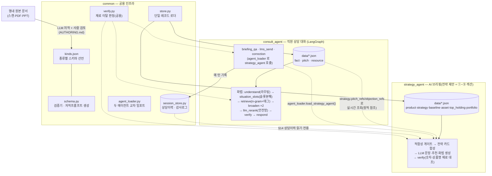

# 퇴직연금 사후관리 에이전트 (Pension Aftercare Agent)

퇴직연금(IRP) 상담 전, 직원에게 **이 고객에게 무엇을 어떻게 제안할지**를 정리해 주는
에이전트 묶음. **코드가 사실을 확정하고 LLM은 표현만 맡는** 구조라, 규제 도메인에서
환각·불완전판매를 구조적으로 막는다.

## 디렉토리

```
src/
├─ common/          공용 인프라 — LLM 클라이언트 · 데이터 규격(store·schema·kinds) · 세션이력 · 두 에이전트 교차 로더
├─ consult_agent/   직원 상담 대화 에이전트 — 화법 코칭을 시작으로 브리핑 질의·상담이력 등으로 넓어지는 자리 (LangGraph)
├─ strategy_agent/  전략 제안 에이전트 — 고객 1명 종합 → 전략 문장·근거·TOP3 (+평가 대시보드)
├─ bff/             프론트 서빙 게이트웨이 — FastAPI JSON API + React 프론트(frontend/)
├─ market/          시황 소스 — 뉴스·금리를 지식으로 정제 (플레이스홀더)
├─ .env             공용 LLM 설정 (커밋 금지) · .env.example 참고
└─ AUTHORING.md     데이터 소스 추가 가이드 (사내 규정·상품 등 + 저작 프롬프트)
```

요건(화면 ①~⑨ · 상담이력 등)의 기준은 [../docs/REQUIREMENTS.md](../docs/REQUIREMENTS.md) 하나다.
코드 주석은 외부 기획안·목업 파일을 직접 인용하지 않고 이 문서를 가리킨다.

`consult_agent`는 원래 화법(pitch) 코칭 전용이었으나("pitch_agent"), 직원과의 대화 전반을
다루는 방향으로 넓어지고 있어 이름을 바꿨다. 화법 검색 자체("pitch" 종류의 카드, `pitch_refs`)는
여전히 이 에이전트가 다루는 기능 중 하나라 그 이름들은 그대로 남아 있다.

향후: `knowhow_agent/`(영업 노하우, 팀원)는 같은 방식으로 붙는다.

## 구조



- **저작**: 원본 문서를 LLM이 읽고 `kinds.json`에 선언된 종류(kind)의 JSON으로 뽑아낸 뒤,
  사람이 검토하고 `schema.py`의 검증기(필수필드·enum·참조·사실충돌·최신성·개인정보 의심 패턴)를
  통과해야 활성화된다.
- **consult_agent**의 화법 검색은 결정론적 검색(n-gram+태그)을 우선 쓰고, 그마저 0건일
  때만 이미 저작된 카드 목록으로 검색 범위를 한정한 LLM 재랭킹(`llm_rerank`)이 보조한다 —
  저장소 전체가 아니라 검증을 통과한 카드만 후보가 되므로, 미승인 내용이 답변에 섞일 수 없다.
  브리핑질의(`briefing_qa`)·수정(`correction`)은 `common/agent_loader.py`로 strategy_agent를
  같은 프로세스에서 불러와 그 결과(`propose()`)만 근거로 답한다 — 화면에 보이는 것과 다른
  사실을 말하지 않는다.
- **strategy_agent**는 consult_agent의 화법 카드 데이터를 실시간 검색하지 않는다. 전략마다
  어떤 화법·반론 카드를 쓸지 저작 시점에 `pitch_refs`/`objection_refs`로 미리 연결해두고,
  요청마다 그 카드의 최신 내용을 그대로 가져온다(복사하지 않으므로 두 시스템이 따로 놀다
  어긋날 일이 없다). 상담이력(`common/session_store.py`)도 같은 원칙으로 읽기 전용 참조한다
  — consult_agent가 기록하고 strategy_agent는 절대 쓰지 않는다. 모든 LLM 산출 문장은
  `common/verify.py`(원래 strategy_agent 전용이었다가 공용화됨)가 재료(숫자·상품명)를
  벗어났는지 대조한다.

## 핵심 설계

- **코드 = 사실 / LLM = 표현.** 수치·상품·적합성은 코드가 정하고, LLM은 문장만 쓴다.
  LLM이 없거나 장애여도 규칙 기반으로 답이 나온다. 이 원칙은 대화형 확장(브리핑질의·수정)에도
  동일하게 적용된다 — `common/verify.py`가 그 접점 전부에서 재사용된다.
- **모든 데이터가 단일 레코드 규격.** `{meta, records:[{id, kind, fields, …}]}` 하나로
  통일 — 종류(`product`·`pitch`·`fact`·`strategy`·`top_holding`·`portfolio`…)는
  `common/kinds.json` 에 선언한다. 새 데이터·새 종류는 파일/선언만 추가하면 검증·저작·적재가
  붙는다 → [AUTHORING.md](AUTHORING.md).
- **에이전트 간 결합은 정적 참조로.** strategy 는 consult_agent의 카드를 검색하지 않고, 저작
  시점에 연결해둔 카드(`pitch_refs`/`objection_refs`)를 요청마다 실시간으로 가져와 자기
  규율로 합성한다 — 검색의 불확실성을 strategy 쪽에 들이지 않으면서도, 카드 내용은 항상
  최신이다. 상담이력도 같은 정적·단방향 원칙(쓰는 쪽과 읽는 쪽을 분리)을 따른다.
- **대화형 기능은 도구(tool) 레지스트리로 갈아끼운다.** LMS 발송처럼 외부 시스템 연동이
  필요한 기능은 `common/tools.py`의 스텁 함수로 자리를 잡아두고, 실제 MCP 연동이 준비되면
  그 함수 본문만 교체한다 — 라우팅 로직(consult_agent.router)은 다시 손댈 필요가 없다.
- **편집 가능 범위는 코드가 못박는다.** 브리핑 수정(consult_agent.correction)은
  `strategy_agent.agent.EDITABLE_FIELDS`에 선언된, LLM이 쓴 산문(AI브리핑 문장·근거해설·카드
  한줄혜택)만 고칠 수 있다. 수치·상품명·조건 판정처럼 코드가 계산한 값은 대화로 못 고치게
  막고, 시스템에 반영되는 게 아니라 이번 세션의 감사로그로만 남는다(재적용 루프는 다음 단계).

## 설정 · 실행

```bash
cp .env.example .env      # 사내 GenAI 게이트웨이 URL·키 입력 (common/llm.py 가 읽음)

# 각 에이전트 실행법은 해당 디렉토리 README 참고
python strategy_agent/agent.py 이현우          # 단일 고객 전략 제안
streamlit run strategy_agent/app.py            # 전략 평가/피드백 대시보드
python consult_agent/graph.py "손실 난 고객 어떻게 상담하죠?"
```

LLM 은 `.env` 의 `LLM_BASE_URL` 유무로 사내(genai)/외부테스트(anthropic)를 자동 전환한다 →
[common/README.md](common/README.md).
