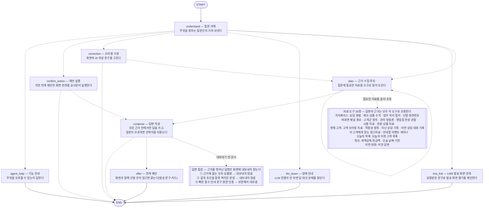

# 퇴직연금 상담 대화 에이전트 (consult_agent)

직원이 고객을 상담하기 전과 상담하는 중에 옆에 두고 묻는 대화형 에이전트. 행원들이 정리한
행내 지식베이스와 지금 열려 있는 고객의 브리핑 재료를 근거로 답하고, 다음 행동(업무 화면
열기 · 브리핑 수정 · 쪽지)까지 잇는다. 퇴직연금 AI 사후관리 에이전트의 두 갈래 중 하나이고,
다른 하나는 AI 브리핑(`../strategy_agent`)이다.

무엇을 할 수 있는지는 도구 목록(`tools/__init__.py::TOOLS`)이 정한다. 새 종류의 재료로
답하게 하려면 도구 하나를 추가한다. 있어야 할 동작의 기준은 [CLAUDE.md](CLAUDE.md) 이고,
이 문서는 사용법과 코드 구조만 적는다.

## 사용

```python
from pension_agent.consult_agent import ask

r = ask("사업자 고객인데 수수료 부담된다고 하시네요. 뭐라고 답변하죠?")
r["answer"]    # 직원에게 코칭하는 해요체 답변
r["sources"]   # [{"id": "pitch.k03.001", "title": "...", "score": 4.80}]

r2 = ask("그럼 안 된다고 하면요?", history=r["history"])            # 후속 질문
r3 = ask("이 고객 만기 언제야?", customer_id="198734-1205842",      # 고객 화면이 열린 턴
         session_id="branch-101-2026-08-24")                        # → 상담이력에도 기록
r4 = ask("오늘 타겟 고객 쪽지로 보내줘", employee_id="3902172")      # 쪽지는 사번이 있어야 제안
```

`customer_id` 가 없으면 고객 관련 기능(브리핑 질의·수정·화면 연계)은 "고객 화면을 먼저
열어주세요"라고 답한다. 지식 질의응답과 화법 코칭은 고객 화면 없이도 답한다.

```bash
python -m pension_agent.consult_agent -c <KB-PIN>    # REPL
python -m tests.test_consult_agent                   # 회귀 테스트 (LLM 키 불필요)
python -m pension_agent.strategy_agent.situations    # 시연용 고객 id · KB-PIN
```

CLI 별칭 · 디버그 실행기 · 대본 실행은 [../../README.md](../../README.md) §3.

## 파일 구조

층은 넷이고 방향은 한쪽이다 — `evidence/` ← `tools/` ← `effects/` ← 그래프(`nodes/`·`graph.py`).
아래 층은 위 층을 임포트하지 않는다(`tests/infra/s03_boundaries.py`). 파일마다의 한 줄
설명은 각 폴더의 `__init__.py` 머리말에 있다.

| 자리 | 무엇 | 파일 |
|---|---|---|
| `graph.py` `state.py` `routing.py` `context_store.py` `__main__.py` | 그래프 뼈대 — LangGraph 조립·`ask()` · 상태·대화이력 포맷 · 분기 표 · 게이트웨이용 맥락 보관 · REPL | 5 |
| `nodes/` | 그래프 노드 — understand(의도) · plan(도구 루프·답변 작성) · answer(형태 판정과 작성을 동시에) · clarify(되묻기) · meta(능력 안내) · lms(발송 화면 제안) · correction(브리핑 수정) · act(화면 연계 제안·확인) | 8 |
| `prompts/` | LLM 프롬프트 문자열 — understand · plan · select · pitch · adequacy · clarify · compose · correction · memo. 쓰는 모듈과 같은 이름 | 10 |
| `tools/` | **LLM 이 계획 루프에서 고르는 도구 20종.** `__init__` 이 레지스트리(`TOOLS`)이자 능력 표면. 도구 규약 `base`, 도구 위에서 도는 `combine`(근거 결합)·`adequacy`(적합성 게이트)도 여기 | 16 |
| `evidence/` | 도구가 근거를 **찾고**(kb_index·select·*_qa·pitch_slots·guard) **원장 항목으로 맞추고**(record·ledger) 답변을 **대조하는**(relations·marks) 것. 도구가 아니고, 도구를 임포트하지 않는다 | 12 |
| `effects/` | 답변 뒤·그래프 밖 — actions(승낙 뒤 행위 게이트) · memo(쪽지 초안) · screens(딥링크) · suggest(추천 칩) · render(텍스트 출력) | 5 |
| `progress.py` | 진행 표시 — nodes·tools 가 함께 쓰는 가로지르는 모듈 | 1 |
| `CLAUDE.md` | 대화형 **기준서** — 있어야 할 동작과 구현 gap 목록. 구현과 어긋나면 문서가 기준. 동작을 바꿀 때 해당 절을 읽는다 | |

지식 카드는 `../knowledge/data/` 에 있다 — 두 에이전트가 함께 읽는 공용 자산이다.

## 그래프 구조

<!-- generated:architecture:start — python -m scripts.render_architecture 가 갱신한다. 손으로 고치지 않는다 -->


실선은 고정된 흐름, 점선은 질문에 따라 갈리는 분기다. 자료 도구와 답변 점검 상자는
LangGraph 노드가 아니라 근거 수집·답변 작성 **안**에서 도는 것을 꺼내 그린 것이다 —
`get_graph()` 출력에 도구가 보이지 않는 이유가 그것이다. 어떤 도구가 있는지와 답변을
내보낼지는 코드가 정하고, 이번 질문에 무엇을 쓸지는 LLM 이 정한다(루트 CLAUDE.md 규칙 2).
코드 대응: 도구 레지스트리 `tools.TOOLS` · 점검 `verify_texts`/`relations`/`span` ·
분기 `routing.py`.
<!-- generated:architecture:end -->

`intent` 는 `situation`(기본값 — 지식·고객 재료로 답하는 질문 전부) / `guide`(직원 업무 기준
질문) / `agent_help` / `lms_link` / `correction` / `confirm_action` / `llm_down` 이다. 목록 밖
값은 기본값으로 떨어지므로 분류가 어긋나도 능력이 잘리지 않는다. 값·절차·고객군·브리핑
질의에 전용 노드는 없고 전부 계획 루프가 답한다.

## 튜닝 포인트

| 위치 | 값 | 의미 |
|---|---|---|
| `tools/pitch.py` `PITCH_TOP_K` | 3 | 프롬프트에 넣을 화법 카드 수 |
| `knowledge/kb.py` `MIN_TOPICAL` | 0.5 | n-gram 폴백 관련도 하한. 낮추면 폴백이 줄고 오답이 는다 |
| `state.py` `HISTORY_LIMIT` | 12 | 프롬프트에 싣고 다음 턴에 넘기는 최근 턴 수. `last_answer` 가 되짚는 범위 |
| `state.py` `HISTORY_VERBATIM` / `HISTORY_OLD_CHARS` | 4 / 40 | 최근 4턴은 질문 원문, 그 앞은 40자에서 접는다(프롬프트만 — 기록은 안 자른다) |
| `nodes/plan.py` `MAX_STEPS` | 4 | 한 턴에 도구를 부르는 바퀴 수 상한 |

## 주의

원본 PDF 는 당행 영업전략·타사대응 노하우가 포함된 대외비 자료다. `../knowledge/data/` 에 그
내용이 그대로 들어 있으므로 저장소 접근권한을 통제한다.
