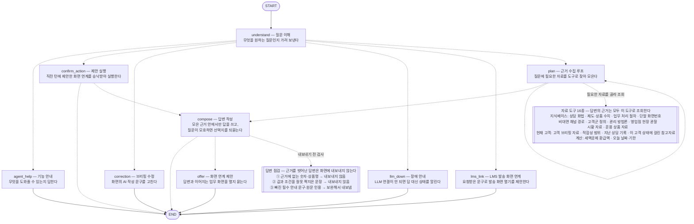

# IRP 상담 대화 에이전트 (LangGraph)

직원이 자연어로 묻는 것을 받아 처리하는 에이전트. 이름 그대로("consult_agent", 구
"pitch_agent") 화법 검색을 넘어 지식 질의응답·고객 브리핑 질의·화면 연계·상담이력
기록(§14, 모든 턴 공통)·브리핑 수정 요청까지 다루는 자리로 커졌다.

**무엇을 할 수 있는지는 도구 목록(`tools.py::TOOLS`)이 정한다.** 새 종류의 재료로 답하게
하려면 도구 하나를 추가한다 — 의도 enum·분기표·노드를 함께 늘리지 않는다. 있어야 할
동작의 기준은 이 폴더의 `CLAUDE.md` 이고, 구현이 그 문서와 어긋나면 구현이 틀린 것이다.

```python
from pension_agent.consult_agent import ask

r = ask("사업자 고객인데 수수료 부담된다고 하시네요. 뭐라고 답변하죠?")
r["answer"]    # 핵심 포인트 1문장 + 근거 2~3문장, 직원에게 코칭하는 해요체
r["sources"]   # [{"id": "pitch.k03.001", "title": "...", "score": 4.80}]

r2 = ask("그럼 안 된다고 하면요?", history=r["history"])   # 후속 질문 — 이전 맥락 이어받음

# 브리핑질의·LMS발송·수정은 customer_id 가 필요하다(현재 열려 있는 브리핑 화면의 고객).
# 넘기면 모든 턴이 src/session_data 에 상담이력으로도 함께 기록된다(REQUIREMENTS.md §14).
r3 = ask("이 고객 만기 언제야?", customer_id="198734-1205842", session_id="branch-101-2026-08-24")
```

아래 명령은 전부 `src/` 에서 실행한다고 가정한다(`cd src`).

```bash
pip install -r requirements.txt
export ANTHROPIC_API_KEY=sk-ant-...

CA="python -m pension_agent.consult_agent"

# 화법 코칭 — 고객 화면 불필요, 단발 실행
$CA "고객이 주식이 더 낫다는데 뭐라고 하지?"

# 고객 화면이 열려 있는 상태로 테스트 — -c/--customer 로 customer_id(KB-PIN) 지정
$CA "이 고객 만기 언제야?" -c 198734-1205842          # 이준호 — 예금 만기 1건 (D-17)
$CA "이 고객 만기 언제야?" -c 193482-6012375          # 오세훈 — 예금·GIC 2건 (D-25 / D-139)

# 실제로 주고받는 멀티턴 테스트 — REPL, 답변 보고 다음 질문을 그때그때 입력
$CA -c 181245-3097614                    # 정민석 — 공격투자형인데 예금 100%
$CA                                      # 고객 화면 없이 화법 코칭만 REPL로

# 멀티턴을 재현 가능한 한 줄로 — 인자를 여러 개 주면 순서대로 한 턴씩(맥락 이어서) 실행. 회귀 테스트·버그 리포트용
$CA -c 198734-1205842 "이 고객 투자성향 뭐야?" "그럼 만기 자금은 뭐라고 안내하지?"

# 「하지 말 것」 가드가 붙는 자리 — 요건에 걸린 고객은 코드가 주의를 얹는다
$CA -c 173544-2074623 "뭐라고 말하지?"     # 김현수 — 현금성 방치·디폴트옵션 미설정

# 값·절차·정의도 같은 경로다 — 계획 루프가 필요한 재료를 골라 온다
$CA "세액공제 한도가 얼마야?"
$CA "디폴트옵션 변경 화면번호 알려줘"
$CA "현금성자산 편중 고객군은 왜 관리 대상이야?"

python -m tests.test_consult_agent               # API 키 없이 검색·라우팅 검증
python -m pension_agent.consult_agent.kb         # 지식베이스 점검 리포트
```

`-c`/`--customer`를 넘기지 않으면 고객 관련 기능(브리핑 질의·수정·화면 연계)은 "고객 화면을
먼저 열어주세요"라고 답한다 — 어느 고객인지가 있어야 성립하는 기능이기 때문이다(`CLAUDE.md` §3).
지식 질의응답과 화법 코칭은 고객 화면 없이도 답한다.

### 시연용 고객 (customer_id = KB-PIN)

목업 9케이스다. 원장은 `../strategy_agent/customers.json`(원본 xlsx → `scripts/import_customers.py`
산출물)이고, 기준일은 2026-08-24 다. 아래 표는 읽기용 요약이므로 **값이 필요하면 코드에서
확인한다** — `python -m pension_agent.strategy_agent.situations` 가 고객별 문제상황을 찍어준다.

| KB-PIN | 고객 | 시스템 배지 | 성립 요건 |
|---|---|---|---|
| `173544-2074623` | 김현수 29세 위험중립형 | 미운용현금자산 | dep·nod·nch (상담이력 없음 → `dorm=None`) |
| `154821-4938201` | 박지민 34세 적극투자형 | 세액공제 잔여 | lim·tax·add (실적배당 75% > 한도 70%) |
| `198734-1205842` | 이준호 41세 적극투자형 | 만기도래 | mat (예금 만기 D-17) |
| `165932-8741205` | 최서윤 47세 위험중립형 | 판매중단펀드보유 | dor·nch (252일 미접촉 · 수익률 −9.4%) |
| `181245-3097614` | 정민석 53세 공격투자형 | 원리금보장 편중 / 성향-운용 불일치 | dor·mis·dep·nch (예금 100%) |
| `176903-5528417` | 한지우 57세 적극투자형 | 세액공제 잔여 / ISA만기자금 | tax·add (잔여 한도 300만원) |
| `193482-6012375` | 오세훈 61세 안정추구형 | 만기도래 / 연금개시 요건충족 후 미개시 | dep·mat (만기 D-25) |
| `162754-9483106` | 윤가영 66세 적극투자형 | 이탈위험관찰 | nod (현금성 52%) |
| `188406-7352194` | 송도윤 72세 위험중립형 | 미운용현금자산 / 판매중단펀드 / ISA만기자금 | dor·nod·nch (322일 미접촉) |

**한 항목에 여러 건이 실릴 수 있다.** 만기가 대표적이다 — 예금과 GIC 의 만기가 서로 다른
고객이 셋 있다(정민석·한지우·오세훈). 요건 판정과 재예치 배분액은 **가장 가까운 한 건**을
쓰지만(`Profile.matDD`·`matAmt`), 재료에는 `Profile.maturities` 로 **전부** 실린다. "만기
언제야?" 에 한 건만 답하면 짧은 게 아니라 틀린 답이다.

**배지와 성립 요건은 다른 축이다.** 배지는 첫 화면에서 시스템이 이미 부여한 값이고(원본
08_BADGES), 요건은 `customer.conditions()` 가 판정한다. 판매중단펀드·ISA만기자금·연금개시
미개시·이탈위험관찰 네 배지는 아직 요건(`CONDS`)이 아니다 — 지식베이스에 판정 근거가
확인돼야 요건으로 세울 수 있어서(루트 `CLAUDE.md` "지식베이스에 없는 기준은 만들지 않는다"),
지금은 `customers.json` 에 재료로만 남아 있고 이 에이전트의 답변에 반영되지 않는다.

**LLM 이 없으면 답하지 않는다.** 규칙·검색만으로 대신 답을 만드는 경로는 두지 않는다 —
근거가 덜 갖춰진 답변이 정상 답변처럼 보이는 것이 무응답보다 위험하다(`CLAUDE.md` §11).

---

## 파일 구조

```
consult_agent/
├── CLAUDE.md           대화형 기준서 — 있어야 할 동작과 구현 gap 목록. 구현과 어긋나면 문서가 기준
├── graph.py            그래프 조립 · ask() (모든 턴을 session_store 에 기록)
├── __main__.py         REPL — python -m pension_agent.consult_agent -c <KB-PIN>
├── state.py            AgentState/Turn · 대화이력 포맷 · 공용 지식베이스(KB)
├── routing.py          INTENTS · 모든 분기(route_*) predicate — 상태만 보고 다음 노드를 고른다
├── kb.py               지식베이스 로드 · 검색 · 계층 인덱스(버킷)
├── tools.py            도구 레지스트리(에이전트가 할 수 있는 일 목록) · 근거(Evidence) 규약 · 원장 helper
├── select.py           카드 선택 — LLM 버킷→카드 2단, LLM 이 0건일 때만 n-gram (종류 무관)
├── guard.py            「하지 말 것」 — 지식베이스에 있는 금지 문장만 띄운다
├── marks.py            재료 성격 표시 — 신뢰 등급 · 내부용 주의 (§7)
├── screens.py          화면 연계 — `mystar-link://` 딥링크 조립 · 발송 화면번호 조회 (§10). 화면번호는 KB 가 갖는다
├── relations.py        관계 기반 점검 — 값–조건 오짝 · 알려진 오답 대조 (§6)
├── prompts.py          LLM 프롬프트 템플릿 (기능별 섹션으로 구분)
├── progress.py         진행 표시 — 답변이 만들어지는 동안 무엇을 하는 중인지 (문구는 코드 소유)
└── nodes/
    ├── understand.py       의도분류 (도메인 어휘 없는 라우팅 전용, 실패하면 답하지 않는다)
    ├── pitch.py            화법 검색 전용 슬롯 분해 — 화법 도구가 필요할 때 부른다
    ├── plan.py             계획 루프 — plan_step(도구 선택·실행) / compose(결합·검증) / llm_down
    ├── answer.py           판별 질문과 답변 작성을 동시에 돌리고 하나를 고른다
    ├── clarify.py          판별 질문 — 갈래가 갈리면 답변 대신 되묻는다 (§5)
    ├── meta.py             메타 질문("뭘 도와줄 수 있어?") 응답 노드
    ├── lms.py              LMS 화면 연계 요청 — 보내지 않고 발송 화면을 제안한다
    ├── correction.py       브리핑 수정 요청 — 편집 가능 필드만, 이번 범위는 감사로그까지
    ├── facts_qa.py         제도·상품 확정값 — fact 도구의 검색·근거 블록 조립
    ├── procedure_qa.py     업무 처리 절차 — procedure 도구의 검색·근거 블록 조립
    ├── segment_qa.py       고객군 정의 — segment 도구의 검색·근거 블록 조립
    └── act.py              화면 연계 제안(offer)·확인 연계(confirm_action)
```

`facts_qa`·`procedure_qa`·`segment_qa` 는 노드가 아니다 — 예전에는 LLM 없이 답을 그대로
돌려주는 즉답 노드였는데, 그 경로를 §11 에 따라 지우면서 검색·조립 함수만 남았고 도구가
쓴다. 같은 재료를 두 경로로 답하면 프롬프트·검증·표시 규약이 갈린다.

답변에 붙는 `sources[].doc` 은 `kb.py::origin_of()` 가 만든 **원본 문서명**이고,
CLI·Streamlit 이 카드 id 대신 이걸 읽어준다(출처 문자열 규칙은 `CLAUDE.md`).

지식 카드는 이 폴더가 아니라 `../knowledge/data/` 에 있다 — strategy_agent 도 함께 읽는
공용 자산이라 한쪽 에이전트가 소유하지 않는다.

| 파일 | 내용 |
|---|---|
| `kb_docs.json` | 원천 문서 레지스트리 (01~04·07 폴더 83건) |
| `kb_segments.json` | 고객 세그먼트 86건 (= 문제상황 정의) |
| `kb_methods.json` | IRP 관리 방법론 131건 |
| `kb_pitches.json` | 영업 화법 102건 |
| `kb_facts.json` | 제도·상품 팩트 64건 |
| `kb_procedures.json` | 업무 처리 절차 74건 |
| `kb_fieldtips.json` | 현장의 목소리 10건 (08_인사이트) |
| `resources.json` | 상담 참고 자료·조회 화면 경로 12건 (손저작 — 06 추출 대상이 아니다) |
| `_hold_kb_facts_pending.json` | 원문이 '확인 필요'로 둔 팩트 — 적재하지 않는다 |
| `_TEMPLATE.json` | 손저작 레코드 파일 템플릿 ('_' 로 시작하면 로더가 건너뜀) |

`kb_*` 는 06_주제별_추출지식에서 `scripts/kb_build` 가 생성한다(생성물 편집 금지 —
루트 `CLAUDE.md` 절대 규칙 3).

지식베이스(`state.KB`)는 `state.py`에서 한 번만 적재해 모든 노드가 가져다 쓴다(순환 임포트
없이 한 방향으로만 의존). `tools.py`의 `customer` 도구와 `nodes/correction.py`는 `strategy_agent`
(engine·agent·customer)를 그냥 임포트한다 — 패키지화 전에는 두 에이전트가 `prompts`/`llm`
같은 동명 모듈을 갖고 sys.modules 를 놓고 경합해서 전용 로더가 필요했지만, 지금은 완전정규화
이름이라 경합 자체가 없다.

무엇을 고치려면 어디를 보는지, 새 도구·새 노드를 붙이는 체크리스트, 지켜야 할 불변
조건(understand 는 라우팅 전용, 폴백 결정성 등)은 전부 이 폴더의 `CLAUDE.md` 에 있다.

---

## 그래프 구조

<!-- generated:architecture:start — python -m scripts.render_architecture 가 갱신한다. 손으로 고치지 않는다 -->


실선은 고정된 흐름, 점선은 질문에 따라 갈리는 분기다. 자료 도구와 답변 점검 상자는
LangGraph 노드가 아니라 근거 수집·답변 작성 **안**에서 도는 것을 꺼내 그린 것이다 —
`get_graph()` 출력에 도구가 보이지 않는 이유가 그것이다. 어떤 도구가 있는지와 답변을
내보낼지는 코드가 정하고, 이번 질문에 무엇을 쓸지는 LLM 이 정한다(루트 CLAUDE.md 규칙 2).
코드 대응: 도구 레지스트리 `tools.TOOLS` · 점검 `verify_texts`/`relations`/`span` ·
분기 `routing.py`.
<!-- generated:architecture:end -->

**전용 노드는 계획 루프로 답할 수 없는 것들뿐이다.** 값·절차·고객군·브리핑 질의는 전부
기본값으로 떨어져 계획 루프가 재료를 고른다 — 무엇으로 답할지는 의도 분류가 아니라 도구
목록이 정한다(`routing.py` 주석).

〔계획 루프〕 — 한 턴에 질문이 요구하는 만큼 도구를 부르고(하나든 여럿이든) 근거를 원장에
쌓은 뒤, 그 원장만으로 답을 만든다(위 다이어그램의 `plan ⇄ tools` 점선이 그 자리다).

`answer` 안에서 **되묻기 판정과 답변 작성이 동시에 돈다**(`nodes/answer.py`). 둘은 서로의
출력을 보지 않고 원장·질문·이전 대화만 입력으로 받는데, 예전에는 배선이 직렬이라 작성이
판정을 기다렸다 — 순수 대기였다. 지금은 동시에 실행하고, 판정이 되묻기로 결정되면 써 둔
답을 버린다. 되묻기는 코드 관문
넷을 통과한 자리에서만 일어나므로 버려지는 일이 잦지 않고, 버릴 때 잃는 것은 토큰이지
답의 품질이 아니다 — 판정도 작성도 프롬프트·입력·게이트가 그대로다.

승낙 턴(`confirm_action`)도 답변이 필요하면 여기로 온다 — 화면 연계 승낙은 URL 하나가
답이라 그 자리에서 끝나지만, 화법 제시 승낙은 지식 카드가 답이라 근거만 싣고 `answer` 로
간다(`routing.route_confirm`). 답변을 만드는 경로를 둘로 늘리지 않기 위해서다. 그 턴에는
되묻기 판정이 돌지 않는다 — 입력이 "네" 한 글자라 모호함을 판정할 질문이 없고, 무엇을
보여주기로 했는지는 제안한 턴이 정했다(`clarify.applicable` · §10).

근거를 못 낸 호출은 `plan_misses` 로 다음 계획 프롬프트에 실린다(원장에는 성공한 재료만
쌓이므로, 이게 없으면 계획은 자기가 뭘 불러봤는지 모른 채 같은 호출을 반복한다). 근거
0건인 채 끝내려 하면(done·반복·미등록 도구) 코드가 안 써 본 도구 목록과 함께 **한 번**
재계획시키고(`plan_retry`), 두 번째 끝내기는 존중한다 — 고르기 실패가 '근거 없음'으로
답해지는 것을 막되, 정직한 '없음' 경로는 막지 않는다(`CLAUDE.md` §5 · 지워진 gap 23).

**하는 일이 없는 LLM 호출을 두지 않는다.** 값 하나 묻는 질문("이 고객 예금 잔액 얼마지")이
순차 호출 6번으로 끝나던 자리를 셋 줄였다 — 화법 슬롯 분해는 화법 도구가 필요할 때만 부르고
(`pitch.extract_slots`), 계획은 `"last": true` 로 한 바퀴에 끝낼 수 있고, 되묻기 판정은 갈래가
있을 수 없는 재료(고객 브리핑)뿐인 턴에는 돌지 않는다. 직원은 상담 중에 이 화면을 읽는다.

**줄일 수 없는 호출은 병렬로 돌린다.** 남은 것 둘 — 카드 종류 전체가 인덱스 예산에 들어가면
버킷 선택(L0)을 생략하고(`kb.whole_index`), 되묻기 판정과 답변 작성은 동시에 돈다(`answer`).
답변 자체는 스트리밍하지 않는다: 생성문이 게이트에서 통째로 폐기될 수 있어 이미 읽은 문장이
사라지기 때문이고, 대신 «지금 무엇을 하는지»를 흘린다(`progress.py` — 문구는 전부 코드 소유).

되묻기 턴에는 화면 연계 제안이 붙지 않는다 — 답변 전에 갈래를 정하는 되묻기와, 화면을
열기 전에 승낙을 받는 연계 확인은 다르다(`CLAUDE.md` §5).

모든 도구가 같은 경로를 탄다 — `compose` 가 근거 전체로 답변 하나를 쓴다. 갈리는 것은 도구가
선언한 **원문 스팬**뿐이고, 그 집행은 코드가 한다(`plan._span_verdict`). 도구별 스팬 선언
현황(`atomic`·`notices`)과 위반 시 처분은 `CLAUDE.md` 의 표를 본다.

| 노드 | 하는 일 | LLM |
|---|---|:---:|
| `understand` | 질문(+이전 대화) → `intent`·`utterance`만 판단(도메인 어휘 없는 라우팅 전용) | ○ |
| `agent_help` | "뭘 도와줄 수 있어?" 같은 메타 질문에 KB 메타데이터로 안내(에이전트 자신에 대한 질문 — 07_에이전트_기능정의/01 ② "가능 여부 즉시 확인"(고객 계좌 상태 조회)과 다름) | ✕ |
| `plan` | 다음에 부를 도구 하나를 고르고 실행해 원장에 쌓음. 상한은 `plan.MAX_STEPS` | ○ |
| `answer` | 되묻기 판정(`clarify`)과 답변 작성(`compose`)을 **동시에** 돌리고 하나를 고름 | ○×2 |
| ├ `clarify` | 근거 안에 갈래가 갈리는데 정할 근거가 없으면 답변 대신 선택지를 보여주고 되묻음 | ○ |
| └ `compose` | 원장만으로 답변 하나를 씀 → 원장 밖 수치·원문 스팬을 코드가 집행. 원장 0건이면 정직하게 없다고 답변 | ○ |
| `llm_down` | LLM 이 죽어 분류조차 못 한 턴 — "LLM 연결이 안 되어 있다"고 원인과 함께 답변 | ✕ |
| `lms_link` | 인용부호로 명시된 문구로 **발송 화면 연계를 제안**(보내지 않는다 — 이름의 `_send` 가 그 거짓말이라 개명했다) | ✕ |
| `correction` | 수정 요청을 편집 가능 필드로 분류 → 편집 가능하면 재작성+검증, 아니면 거절 | ○ |
| `offer` | 답변이 가리키는 화면이 있으면 "연계해드릴까요?" 를 덧붙이고 `pending_action` 설정 | ✕ |
| `confirm_action` | 직전 **한 턴**의 제안에 대한 "네"/"아니오" → 화면 URL 연계 또는 철회 | ✕ |

- `intent`: `situation`(기본값 — 지식·고객 재료로 답하는 질문 전부. 고객 대사를 그대로 던진
  질문도 여기다) / `guide`(직원 업무 기준 질문) / `agent_help`(메타 질문) /
  `lms_link`(발송 화면 연계 요청) / `correction`(브리핑 수정 요청) /
  `confirm_action`(제안 확인) / `llm_down`(LLM 장애). 목록 밖 값은 기본값으로 떨어진다 — 분류가 어긋나도 능력이 잘리지
  않는다. `guide`도 같은 경로를 타되 응답 프롬프트 톤만 다름.
- **값·절차·고객군·브리핑 질의에 전용 노드는 없다.** 예전에는 각각 intent 와 노드를 갖고
  LLM 없이 답을 그대로 돌려줬는데, ① 같은 재료를 두 경로로 답하게 되고 ② LLM 이 죽어도
  절반은 도는 경로가 굳는다. 지금은 전부 계획 루프가 답한다(`CLAUDE.md` §3·§11).
- 고객 관련 기능(브리핑 질의·수정·화면 연계)은 `state["customer_id"]`(호출자가
  `ask(..., customer_id=...)`로 넘김)가 있어야 동작한다 — 없으면 "고객 화면을 먼저 열어달라"고
  답한다. 지식 질의응답·화법 코칭은 없이도 답한다.
- **답변에 영향을 준 재료는 전부 출처에 실린다.** 열려 있는 고객의 브리핑 재료도,
  「하지 말 것」 가드와 대안 화법 카드도 출처를 낸다 — 답변 내용을 바꾸는 재료가 출처
  목록에 없으면 화면에 "근거: 없음"이 뜨고, 직원은 근거 없이 나온 말처럼 읽는다.
- **고른 근거가 질문에 답이 되는지 판정한다.** 재료 종류를 가리지 않고, 판정은 **카드
  하나씩**이다(`tools.fits_question`) — 주제어만 겹친 카드는 채택 직전에 버려지고 맞는 카드만
  남는다. 남은 것이 하나도 없어 원장이 비면 정직하게 없다고 답한다.
- **답의 양식을 위해 품질 장치를 우회하지 않는다.** 고객 대사를 그대로 던진 질문에 대괄호
  양식(`[고객 발화]`·`[완성 대사]`)으로 답하는 전용 노드가 있었는데, 그 하나가 계획 루프를
  통째로 우회해서 적합성 판정도 재료 성격 표시도 형태 요구도 걸리지 않았다. 지금은 같은
  화법 재료로 설명형 답변을 쓴다(`CLAUDE.md` §5 「양식은 요건이 아니다」).
- **한 턴에 여러 재료를 결합한다.** 예전에는 의도 하나 = 노드 하나 = 답변 하나여서 재료
  하나만 쓸 수 있었다. 지금은 계획 루프가 고객 재료 → 확정 수치 → 화법을 차례로 모아 한
  답변으로 낸다. 결합 순서와 개수는 LLM 이 정하고, 상한은 코드가 정한다.
- **카드 선택은 LLM 이 1차, n-gram 이 폴백이다.** 원래는 반대였는데, n-gram 은 문자 유사도라
  "주제어만 겹치는 확신 있는 오답"을 만들고 그걸 게이트로 사후에 걸러내는 구조였다. 애초에
  의미로 고르면 그 오답이 생기지 않으므로 순서를 뒤집었다. n-gram 은 버리지 않았다 —
  **LLM 이 살아서 0건을 냈을 때만** 돈다(LLM 장애는 폴백이 아니라 무응답이다, §11). 단 `method`·`fieldtip` 은 `trigger_examples`가 제목과 거의
  같아서 n-gram 폴백이 약하다 — 이 종류에서는 LLM 선택이 사실상 주 경로다.
- LLM 실패 시 폴백 동작, 후보 범위·오답 차단 등 검증 규칙은 `CLAUDE.md` 의
  「답변 검증」·「불변 조건」 참고.
- `retrieve`는 `stage`/`customer_type`으로 먼저 후보를 좁힌 뒤 채점 — 챕터 간 같은 라벨(예: "수수료 비교"가 퇴직금·계약이전에 둘 다 있음)이 섞이지 않음. 세부 로직·근거는 `nodes/pitch.py`/`kb.py` 코드 주석 참고.
- 후속 질문은 `ask()`가 돌려준 `history`를 다음 호출에 그대로 넘기면 됨(세션 유지는 호출자 책임, 최근 4턴만 반영).

---

## 지식베이스 구조

화법 카드는 사실을 **ID로 참조만** 합니다(복붙 안 함).

| 계층 | 내용 | 이유 |
|---|---|---|
| `facts` | 세액공제율·납입한도 등 재사용 사실 + 06/04 제도 팩트 | 세법 개정 시 한 줄만 고치면 전체 반영, 문서 간 수치 충돌 자동 탐지 |
| `cards` | 검색 대상 전체 — 화법(`pitch`)·고객군(`segment`)·방법론(`method`)·절차(`procedure`)·현장의 목소리(`fieldtip`) | `kinds.json` 의 `consumed: retrieval` 선언에서 적재된다. 새 종류를 선언하면 적재가 따라온다 |
| `pitches` | 그중 화법 카드만 따로 (기존 검색 경로 호환) | 태그로 필요한 것만 프롬프트에 넣어 문서가 늘어도 프롬프트 크기 일정 |
| `resources` | 상품안내장, 원픽 가이드 등 | `customer_facing`으로 내부용 자료 유출 방지 |
| `docs_by_id` | 원천 문서 레지스트리(01~04) | 카드의 `source.doc` 을 조인해 **원본 문서명·부서·게시시점**으로 출처를 말한다 |

`retrieve(kb, kinds=[...])` 로 종류를 지정하면 그 종류에서 찾고, 생략하면 화법 카드에서 찾는다
(기존 동작). `kb.source_label(kb, card)` 가 출처 한 줄을 만든다.

**06_주제별_추출지식 갱신**: 원문을 고친 뒤 `python -m scripts.kb_build.build_kb` →
리포트 확인 → `--activate` (생성 JSON 직접 편집 금지 — `src/AUTHORING.md` §4-a).

**새 지식 추가**: 화법·팩트·절차·세그먼트·방법론은 손으로 파일을 만들지 않는다 — 06_주제별_추출지식에
원문을 넣고 위의 `build_kb` 로 생성한다. 손저작이 남아 있는 종류는 06 추출 대상이 아닌 자료 경로
(`resources.json` 의 resource)뿐이고, `_TEMPLATE.json` 이 그 형식이다. 어느 쪽이든
`python -m pension_agent.consult_agent.kb` 로 ERROR 0건을 확인한다.

### 화법 카드 목록

`python -m pension_agent.consult_agent.kb` 가 챕터별 카드 전체(ID·제목·단계·거절유형·대화/근거/트리거 수)를 최신
상태로 출력합니다. 카드 추가·수정 시 별도 문서 갱신 없이 이 명령으로 확인하세요.

---

## 검증 & 환각 방지

`python -m pension_agent.consult_agent.kb` 가 ERROR로 잡는 것: 필수 필드 누락·잘못된 값, ID 중복, 깨진 fact/resource 참조, 같은 항목에 문서마다 다른 값(개정 반영 누락), objection 카드인데 거절유형 태그 없음. 현재 **ERROR 0건**.

- 검색 채택 기준을 **내용 관련도**로 걸고, 그 위에 적합성 게이트(`tools.fits_question`)가
  "이 근거가 질문에 답이 되는가"를 재료 종류를 가리지 않고 판정한다 — 애매하면 버린다
- `agent_help` 응답도 LLM 호출 없이 KB 메타데이터만으로 생성 — 없는 기능을 있다고 답할 수 없음
- 답에는 **재료 성격 표시**가 함께 붙는다(`marks.py`) — 어느 자료에서 왔는지(신뢰 등급)와,
  내부용 자료면 "고객에게 그대로 안내하지는 마세요". 막지는 않는다: 무엇을 옮길지는 직원이 정한다
- 답변 검증·수치 한정·표시 규칙은 `CLAUDE.md` §6·§7 참고

---

## 튜닝 포인트

| 위치 | 값 | 의미 |
|---|---|---|
| `tools.py` `PITCH_TOP_K` | 3 | 프롬프트에 넣을 화법 카드 수. 늘리면 맥락↑ 토큰↑ |
| `kb.py` `MIN_TOPICAL` | 0.5 | 낮추면 fallback이 줄고 오답이 늘어남 (실측: 유관 0.55~2.1 / 무관 0.00~0.42) |

---

## 주의

원본 PDF는 당행 영업전략·타사대응 노하우가 포함된 대외비 자료입니다. `../knowledge/data/`에 그 내용이
그대로 들어 있으므로 저장소 접근권한을 반드시 통제하세요.

---

## 상담이력 · 화면 연계 · 브리핑 수정

- **상담이력(§14)**: `graph.py::ask()`가 `customer_id`를 받으면 매 턴(질문+답변)을
  `src/session_data/{customer_id}.json`에 기록한다. `strategy_agent.engine.prepare()`는 이
  기록을 `facts["consult_history"]`로 **읽기만** 한다 — consult_agent 가 기록하고
  strategy_agent 가 읽는 단방향 관계라 "코드=사실" 경계를 대화이력에도 그대로 적용한다.
- **화면 연계(`nodes/act.py` · `screens.py`)**: 에이전트는 **화면을 열어줄 뿐 작업을 대신
  수행하지 않는다**(`CLAUDE.md` §10). 답변이 직원이 이어서 할 일을 가리키면(절차의 화면번호,
  고객에게 보낼 문구의 발송 화면) 연계를 제안하고, 다음 턴의 "네"에 그 화면을 여는 딥링크를
  준다. 보낼지 말지는 직원이 그 화면에서 정한다.
  - **링크 형식은 단말 연동 규격이다.** `mystar-link://scnNo=0612604&mode=D` — 스킴 뒤에
    바로 `키=값` 이 `&` 로 이어진다. `scnNo` 는 화면호출번호 7자리(KB 표기 `[06-12-604]` 에서
    구분자를 뺀 것)나 단말화면번호 11자리이고, `mode` 는 운영 `O`·스테이징 `S`·개발 `D` 로
    지금은 개발이다(`TERMINAL_SCREEN_MODE` 로 전환 · `docs/DEMO_STATUS.md`).
  - **규격에 없는 파라미터는 싣지 않는다.** 고객 식별자·발송 문구는 링크로 넘어가지 않는다 —
    단말이 받는 이름이 정해지지 않았기 때문이고, 직원이 열린 화면에서 입력한다. 그래서
    답변은 "무엇을 채웠다"고 말하지 않고, 링크가 못 싣는 발송 문구는 붙여넣을 수 있게
    답변에 함께 준다.
  - **화면번호는 지식베이스가 갖는다.** `screens.py` 에는 화면번호가 하나도 없다 — 절차
    안내의 번호는 그 답변의 근거 카드에서 오고, 발송 화면은 절차 카드에서 찾는다. 없는
    번호로 링크를 만들면 직원이 엉뚱한 화면에서 작업하게 된다.
  - **제안 여부는 규칙이 정한다**(LLM 아님). 매 턴 "연계해드릴까요?"가 붙으면 직원이 그
    문장을 읽지 않게 되고, 그러면 확인 절차가 의미를 잃는다.
  - **제안은 그 자리에서만 유효하다.** 확인 응답은 직전 **한 턴**의 제안만 실행한다. 직원이
    확인 대신 다른 질문을 하면 그 제안은 자동으로 무효가 된다.
  - 제안 인자는 `history` 턴의 `pending_action` 에만 남는다 — 답변 원문은 계속 담지 않으면서
    (프롬프트 비용) "그 문구"가 무엇인지는 잃지 않기 위한 최소 상태다. `ask()` 도
    `pending_action` 을 돌려주므로 화면이 버튼으로 눌러도 같은 경로를 탄다.
- **더미 게이트**: `pension_agent/tools.py::open_lms_screen` 은 발송하지 않고, **더미 콘텐츠에서
  온 문구를 발송 화면에 채우는 것을 거부한다** — 채워 넣으면 직원이 그대로 보낼 수 있기
  때문이다. MCP 연동이 준비되면 함수 **본문만** 교체하면 된다(레지스트리 키·시그니처 불변).
  `register_consult_note`(상담 이력 등록)도 같은 레지스트리에 있다.
- **브리핑 수정**: 편집 가능 항목은 `strategy_agent.agent.EDITABLE_FIELDS`(AI브리핑
  문장·근거해설·카드 한줄혜택 — 전부 LLM 이 쓴 산문)로 코드가 못박아둔다. 수치·상품명·전략
  선정처럼 시스템이 계산한 값을 고쳐달라는 요청은 조용히 수용하지 않고 명확히 거절한다.
  승인된 수정은 세션이력에 감사로그로만 남고, 다음 브리핑 생성에 자동 반영되는 재적용 루프는
  아직 없다 — 그 루프는 "코드=사실" 경계를 실제로 어떻게 지킬지 더 구체적인 설계가 필요한
  다음 단계 항목이다.
