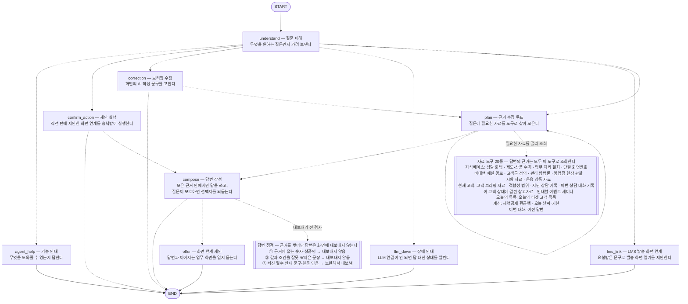

# IRP 상담 대화 에이전트 (LangGraph)

직원이 자연어로 묻는 것을 받아 처리하는 에이전트. 화법 검색을 넘어 지식 질의응답·고객
브리핑 질의·화면 연계·상담이력 기록·브리핑 수정 요청·쪽지 발송까지 다룬다.

**무엇을 할 수 있는지는 도구 목록(`tools/__init__.py::TOOLS`)이 정한다.** 새 종류의 재료로
답하게 하려면 도구 하나를 추가한다 — 의도 enum·분기표·노드를 함께 늘리지 않는다. 있어야 할
동작의 기준은 이 폴더의 [CLAUDE.md](CLAUDE.md) 이고, 구현이 그 문서와 어긋나면 구현이 틀린
것이다. 이 문서는 **사용법과 현재 코드 구조**만 적는다.

## 사용

```python
from pension_agent.consult_agent import ask

r = ask("사업자 고객인데 수수료 부담된다고 하시네요. 뭐라고 답변하죠?")
r["answer"]    # 핵심 포인트 1문장 + 근거 2~3문장, 직원에게 코칭하는 해요체
r["sources"]   # [{"id": "pitch.k03.001", "title": "...", "score": 4.80}]

r2 = ask("그럼 안 된다고 하면요?", history=r["history"])   # 후속 질문 — 이전 맥락 이어받음

# 브리핑질의·LMS발송·수정은 customer_id 가 필요하다(현재 열려 있는 브리핑 화면의 고객).
# 넘기면 그 턴이 src/session_data 에 상담이력으로도 함께 기록된다(REQUIREMENTS.md §14).
r3 = ask("이 고객 만기 언제야?", customer_id="198734-1205842", session_id="branch-101-2026-08-24")

# 쪽지 발송(«오늘 타겟 쪽지로 보내줘»)은 보내는 직원의 사번(employee_id)이 있어야 제안한다.
r4 = ask("오늘 타겟 고객 쪽지로 보내줘", employee_id="3902172", x_client_user="3902172")
```

`customer_id` 가 없으면 고객 관련 기능(브리핑 질의·수정·화면 연계)은 "고객 화면을 먼저
열어주세요"라고 답한다. 지식 질의응답과 화법 코칭은 고객 화면 없이도 답한다.

CLI · 디버그 · 대본 실행은 [../../README.md](../../README.md) §3 에 있다(`source bin/cli.sh`
→ `$CA` · `$CAD` · `$CADR`). 시연용 고객의 id 와 상태는 코드가 찍어준다:

```bash
python -m pension_agent.strategy_agent.situations   # 고객별 문제상황 · KB-PIN
python -m tests.test_consult_agent                  # 라우팅·도구 루프·가드 (LLM 키 불필요)
python -m pension_agent.knowledge.kb                # 지식베이스 점검 리포트 — ERROR 0건 유지
```

## 파일 구조

층은 넷이고 방향은 한쪽이다 — `evidence/` ← `tools/` ← `effects/` ← 그래프(`nodes/`·`graph.py`).
아래 층은 위 층을 임포트하지 않는다(`tests/infra/s03_boundaries.py` 가 고정). 파일마다의
한 줄 설명은 각 폴더의 `__init__.py` 머리말에 있다.

| 자리 | 무엇 | 파일 |
|---|---|---|
| `graph.py` `state.py` `routing.py` `context_store.py` `__main__.py` | 그래프 뼈대 — LangGraph 조립·`ask()` · 상태·대화이력 포맷 · 분기 표 · 게이트웨이용 맥락 보관 · REPL | 5 |
| `nodes/` | 그래프 노드만 — understand · plan · answer(+clarify) · meta · lms · correction · act | 8 |
| `prompts/` | LLM 프롬프트 문자열 — 노드와 같은 이름의 모듈로 나눠 둔다 | 10 |
| `tools/` | **LLM 이 계획 루프에서 고르는 도구 20종.** `__init__` 이 레지스트리(`TOOLS`)이자 능력 표면. 도구 규약 `base`(Tool·ToolFailure), 도구 위에서 도는 `combine`(근거 결합)·`adequacy`(적합성 게이트)도 여기 | 16 |
| `evidence/` | 도구가 근거를 **찾고**(kb_index·select·*_qa·pitch_slots·guard) **원장 항목으로 맞추고**(record·ledger) 답변을 **대조하는**(relations·marks) 것. 도구가 아니고, 도구를 임포트하지 않는다 | 12 |
| `effects/` | 답변 뒤·그래프 밖 — actions(승낙 뒤 행위 게이트) · memo(쪽지 초안) · screens(딥링크) · suggest(추천 칩) · render(텍스트 출력) | 5 |
| `progress.py` | 진행 표시 — nodes·tools 가 함께 쓰는 가로지르는 모듈이라 최상위 | 1 |
| `CLAUDE.md` | 대화형 **기준서** — 있어야 할 동작과 구현 gap 목록. 구현과 어긋나면 문서가 기준. 코드를 파악할 때가 아니라 **동작을 바꿀 때** 해당 절을 읽는다 | |

지식 카드는 이 폴더가 아니라 `../knowledge/data/` 에 있다 — strategy_agent 도 함께 읽는
공용 자산이라 한쪽 에이전트가 소유하지 않는다(`kb_*.json` 은 `scripts/kb_build` 생성물,
루트 `CLAUDE.md` 절대 규칙 3). 목록과 건수는 `python -m pension_agent.knowledge.kb` 가 찍는다.

## 그래프 구조

<!-- generated:architecture:start — python -m scripts.render_architecture 가 갱신한다. 손으로 고치지 않는다 -->


실선은 고정된 흐름, 점선은 질문에 따라 갈리는 분기다. 자료 도구와 답변 점검 상자는
LangGraph 노드가 아니라 근거 수집·답변 작성 **안**에서 도는 것을 꺼내 그린 것이다 —
`get_graph()` 출력에 도구가 보이지 않는 이유가 그것이다. 어떤 도구가 있는지와 답변을
내보낼지는 코드가 정하고, 이번 질문에 무엇을 쓸지는 LLM 이 정한다(루트 CLAUDE.md 규칙 2).
코드 대응: 도구 레지스트리 `tools.TOOLS` · 점검 `verify_texts`/`relations`/`span` ·
분기 `routing.py`.
<!-- generated:architecture:end -->

| 노드 | 하는 일 | LLM |
|---|---|:---:|
| `understand` | 질문(+이전 대화) → `intent`·`utterance`만 판단(도메인 어휘 없는 라우팅 전용) | ○ |
| `agent_help` | "뭘 도와줄 수 있어?" 같은 메타 질문에 KB 메타데이터로 안내 | ✕ |
| `plan` | 다음에 부를 도구 하나를 고르고 실행해 원장에 쌓음. 상한은 `plan.MAX_STEPS` | ○ |
| `compose` (`nodes/answer.py`) | 형태 판정(`clarify`)과 답변 작성(`compose`)을 **동시에** 돌리고 하나를 고름. `assume`·`none` 이면 블록을 얹어 한 번 다시 씀 | ○×2 |
| ├ `clarify` | 답의 형태를 넷으로 판정 — 답한다 / 전제를 밝히고 답한다 / 되묻는다 / 핵심 대상이 없다 | ○ |
| └ `compose` | 원장만으로 답변 하나를 씀 → 원장 밖 수치·원문 스팬을 코드가 집행. 원장 0건이면 정직하게 없다고 답변 | ○ |
| `llm_down` | LLM 이 죽어 분류조차 못 한 턴 — "LLM 연결이 안 되어 있다"고 원인과 함께 답변 | ✕ |
| `lms_link` | 인용부호로 명시된 문구로 **발송 화면 연계를 제안**(보내지 않는다) | ✕ |
| `correction` | 수정 요청을 편집 가능 필드로 분류 → 편집 가능하면 재작성+검증, 아니면 거절. 「화면 문장이 아니라 방금 한 답변을 고쳐 달라는 것」이면 답을 내지 않고 `plan` 으로 넘긴다(`last_answer` 도구가 그 답변을 재료로 싣는다) | ○ |
| `offer` | 답변이 가리키는 화면이 있으면 "연계해드릴까요?" 를 덧붙이고 `pending_action` 설정 | ✕ |
| `confirm_action` | 직전 **한 턴**의 제안에 대한 "네"/"아니오" → 화면 URL 연계 또는 철회 | ✕ |

`intent` 는 `situation`(기본값 — 지식·고객 재료로 답하는 질문 전부) / `guide`(직원 업무
기준 질문, 응답 톤만 다름) / `agent_help` / `lms_link` / `correction` / `confirm_action` /
`llm_down` 이다. 목록 밖 값은 기본값으로 떨어진다 — 분류가 어긋나도 능력이 잘리지 않는다.
값·절차·고객군·브리핑 질의에 전용 노드는 없고 전부 계획 루프가 답한다(`CLAUDE.md` §3·§11).

## 튜닝 포인트

| 위치 | 값 | 의미 |
|---|---|---|
| `tools/pitch.py` `PITCH_TOP_K` | 3 | 프롬프트에 넣을 화법 카드 수. 늘리면 맥락↑ 토큰↑ |
| `knowledge/kb.py` `MIN_TOPICAL` | 0.5 | 낮추면 n-gram 폴백이 줄고 오답이 늘어남 (실측: 유관 0.55~2.1 / 무관 0.00~0.42) |
| `state.py` `HISTORY_LIMIT` | 12 | 프롬프트에 싣고 다음 턴에 넘기는 최근 턴 수. `last_answer` 가 되짚을 수 있는 범위이기도 하다. 12턴 블록은 접기 전 455자, 아래 접기 뒤 약 250자 |
| `state.py` `HISTORY_VERBATIM` / `HISTORY_OLD_CHARS` | 4 / 40 | 최근 4턴은 질문 원문, 그 앞은 40자에서 접는다(프롬프트 한 줄만 — 기록은 안 자른다) |

## 주의

원본 PDF 는 당행 영업전략·타사대응 노하우가 포함된 대외비 자료다. `../knowledge/data/` 에 그
내용이 그대로 들어 있으므로 저장소 접근권한을 통제한다.
